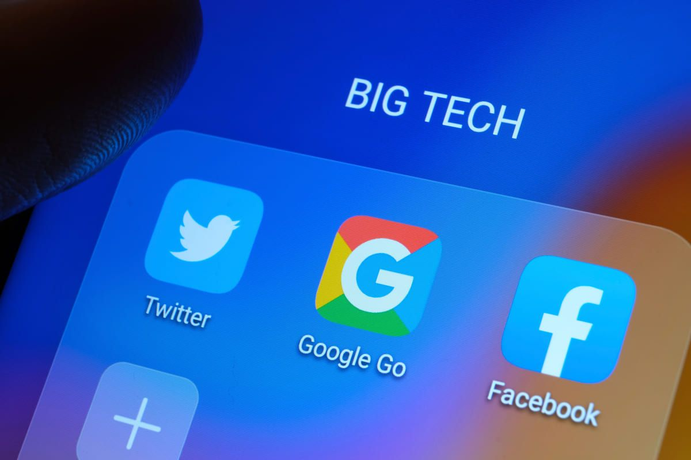

## Introduction

In today's digital age, privacy concerns are at the forefront of many discussions. With the dominance of big tech companies, it can feel like our every move online is being tracked and monitored. But what if I told you there's a way to reclaim your digital privacy without sacrificing convenience? Enter Free and Open Source Software (FOSS) Android apps. Let me take you through my daily routine, powered by FOSS apps, that replace the mainstream alternatives.

## Apps

**1. SimpleLogin:** Protecting my email privacy has never been easier. With SimpleLogin, I create unique aliases for every service I sign up for, shielding my primary email from spam and tracking.

**2. Mullvad VPN:** Ensuring my online activities remain private and secure, Mullvad VPN encrypts my internet connection, keeping my data safe from prying eyes.

**3. NeoStore:** A convenient interface for accessing the vast repository of FOSS apps on F-Droid

**4. Aurora Store:** For apps not available on traditional app stores, Aurora Store allows me to download and update apps from the Google Play Store anonymously, without the need for a Google account.

**5. Tuta:** With end-to-end encryption and zero-tracking policies, Tuta is my go-to email service for secure communication.

**6. Proton:** The one-stop solution for digital privacy. From encrypted email services to VPN protection, secure cloud storage with photo auto-sync, password management, and a private calendar.

**7. SimpleX Chat:** Redefines secure messaging with its two-layer end-to-end encryption.

**8. Molly:** A privacy-focused fork of Signal messenger, Molly enhances push notifications and operates independently from Google Mobile Services (GMS), ensuring my messages are secure and private.

**9. NewPipe:** Say goodbye to YouTube's tracking and ads. NewPipe is a lightweight YouTube client that allows me to watch videos and listen to music without compromising my privacy.

**10. LibreTube:** Built upon the foundation of NewPipe, LibreTube fetches videos from the Piped.video API, providing a decentralized and privacy-focused platform for watching online content.

**11. ente Photos:** Keeping my photos organized and secure, ente Photos offers end-to-end encryption and local storage options, ensuring my memories remain private.

**12. MEGA:** For cloud storage needs, MEGA provides secure, encrypted storage with generous free tiers and cross-platform support.

**13. Mull:** Mull is a privacy-focused fork of the Firefox browser, removing trackers and other privacy-invading elements, providing a more secure browsing experience.

**14. Brave:** A privacy-focused web browser, Brave blocks ads and trackers by default, providing a faster and safer browsing experience.

**15. CuteCalc:** Adding a touch of whimsy to my daily tasks, CuteCalc is a fully functional calculator app with a charming design.

**16. GrapheneOS:** Protecting my device from security threats, GrapheneOS is a privacy-focused Android operating system that prioritizes security and user control.

**17. Quillpad:** Taking notes with true offline, unlike Google that stole your notes.

**18. Binary Eye:** For scanning QR codes without compromising privacy.

**19. KeePassDX:** Managing my passwords securely, KeePassDX stores my credentials in an encrypted database, accessible only with a master password or key file.

**20. PCAPdroid:** Monitoring network traffic on my device, PCAPdroid helps me identify and block suspicious connections, enhancing my security.

**21. LocalSend:** Need to transfer files between devices? LocalSend utilizes peer-to-peer technology for fast and secure file sharing over local networks.

**22. KDE Connect:** Seamlessly integrating my Android device with my desktop environment, KDE Connect allows for file sharing, notifications, and remote control across devices.

**23. microG:** Enjoying the benefits of Google services without sacrificing privacy, microG is a free and open-source reimplementation of Google's proprietary libraries, allowing for a more privacy-respecting Android experience.

**24. Aves:** Aves serves as a secure gallery app, ensuring your images and photos are stored with privacy and protection in mind.

**25. Neo Launcher:** Customizing my Android experience, Neo Launcher provides a lightweight, privacy-focused alternative to traditional launchers.

**26. URL Cleaner:** Protecting my browsing habits from prying eyes, URL Cleaner automatically removes tracking parameters from URLs, preserving my privacy online.

**27. Coffee:** Coffee is a handy tool that allows you to prevent your screen from timing out, ensuring it stays on when you need it. This minimalist app doesn't track your location or personal data, providing a simple and effective solution for keeping your screen awake.

## Take back our Privacy

With these FOSS Android apps, taken back control of our digital life, prioritizing privacy and security without sacrificing functionality. reclaiming your online privacy with FOSS alternatives to mainstream apps.
