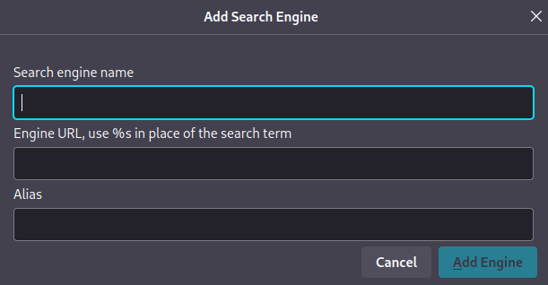
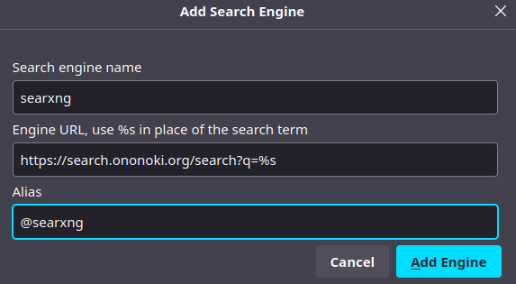

## Introduction

If you're a Firefox user looking to set a different default search engine in the desktop version, you might have noticed that while this option is available in the mobile version, it's not as straightforward on desktop. By default, you're limited to a set of preset search engine options such as `DuckDuckGo`, `Google`, and `Bing`. lets dive into how you can customize your default search engine in Firefox desktop :)

### Modifying Firefox Configuration

Before we dive into the steps, keep in mind that these instructions involve modifying Firefox's configuration settings, which requires a bit of technical know-how. But don't worry, we'll guide you through the process.

### Step 1: Accessing the Configuration Page

1. Open Firefox and type `about:config` in the address bar.
2. You'll see a warning message about the risks of changing advanced settings. Click on the `Accept the Risk and Continue` button to proceed.

### Step 2: Enabling Additional Search Engines

1. In the search bar at the top of the `about:config` page, enter `browser.urlbar.update2.engineAliasRefresh`.

2. Locate the preference named `browser.urlbar.update2.engineAliasRefresh` and double-click on it to toggle its value from `false` to `true`.

   

### Step 3: Adding Your Preferred Search Engine

1. Now, head back to the Firefox search settings. You'll notice a new option: `Add.` Click on this option.

   

2. Enter the details of your preferred search engine:

   - Search Engine Name: SearXNG
   - Engine URL: `https://search.ononoki.org/search?q=%s`
   - Alias: @SearXNG

3. Click `Add Engine` to save your custom search engine.

### Step 4: Set Your Custom Search Engine as Default

1. Return to the search settings and find your newly added search engine in the list.

2. Click on the three-dot menu next to your custom search engine and select `Set as Default.`

## Conclusion

I recall searching for information on how to customize the default search engine in Firefox desktop, but I struggled to find any useful resources on the topic. While there are methods that involve using extensions, I preferred not to install any additional extension for this purpose.

Eventually, I discovered a solution on Stack Overflow, and I compiled the information provided there, adding images to enhance clarity and make it easier to understand.
