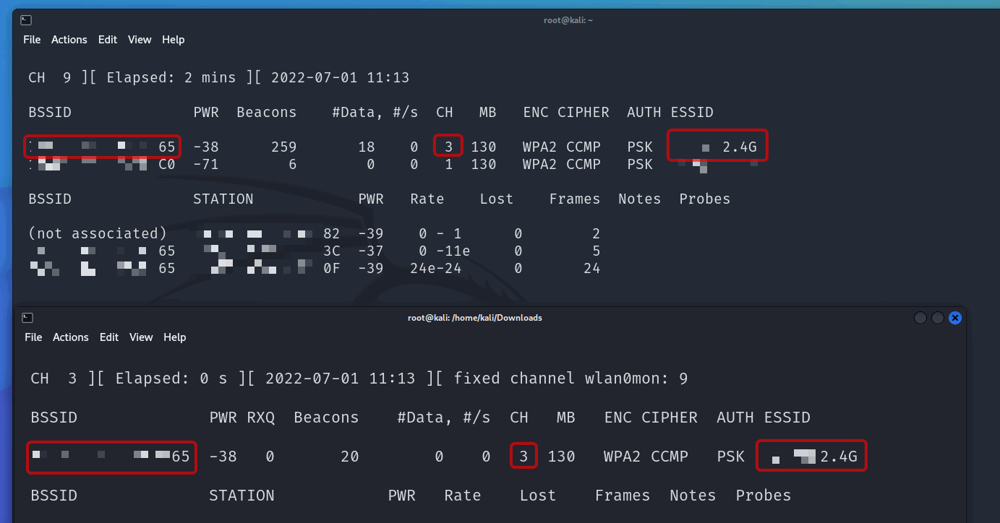
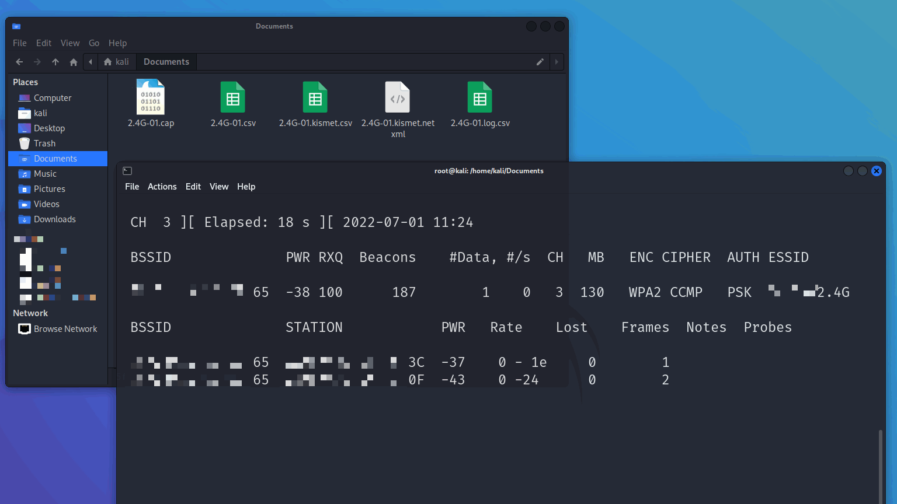
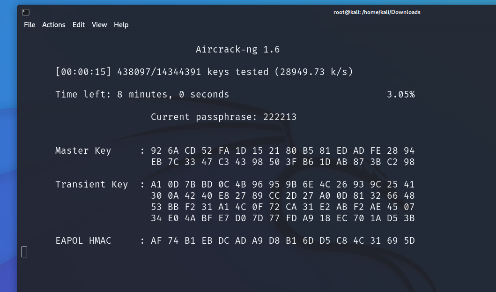

## Aircrack-ng?

to make a long story short. Aircrack-ng is a network software suite consisting of WiFi security tools that can be used to assess the security of wireless networks. It focuses on different areas of WiFi security, including monitoring, attacking, testing, and cracking.

### Disclaimer

This guide is for educational purposes only. Unauthorized access to wireless networks is illegal and unethical. Always obtain permission from the network owner before attempting to access or test their network security.

Only cracking your own network or network owner allowed you to do this.

## Step 1: Hardware Requirements

To getting started with Aircrack-ng, you'll need a compatible wireless network adapter that supports monitor mode and packet injection.

And also, Use a computer with a GNU/Linux operating system, such as Kali Linux, which comes pre-installed with Aircrack-ng. or you can install by yourself. like this:

```bash
sudo pacman -S aircrack-ng
```

>Note: Below action will use sudo previlege all the time. So its better to use root user.

## Step 2: Checking Card Status

First, check if your wireless card supports monitor mode and recognizes the wireless interface:

```shell
iwconfig
```


## Step 3: Starting Monitor Mode

Enable monitor mode on your wireless interface `wlan0` its will disable your network connection.

```shell
airmon-ng start wlan0
```


## Step 4: Finding Target WiFi Network

Identify the WiFi network, we will need the following information for the target network and crack it.

- ESSID (network name)
- BSSID (MAC address of the access point)
- Channel number

```shell
airodump-ng wlan0mon
```


## Step 5: Creating Capture File

Capture data from the target network:

```shell
airodump-ng -d [BSSID] -c[channel] -w [capture filename] wlan0mon
```




## Step 6: Performing Deauthentication Attack

This will fucking disconnect that wifi network and trying to capture inside the user handshark by they reconnecting to the network. The handshake aor PMKID is necessary to crack the WiFi password. You also can use the handshark and use other tools to crack the password like hashcat.

```shell
aireplay-ng --deauth 0 -a [BSSID] wlan0mon
```


## Step 7: Cracking the Password

Once you've captured the handshake or PMKID, use Aircrack-ng to crack the WiFi password:

```shell
aircrack-ng [capture filename] -w [password list file]
```



## Finaly Step: Closing Monitor Mode

After you've finished testing the network security, stop the monitor mode on your wireless interface, and now your network connection will be back.

```shell
airmon-ng stop wlan0mon
```

