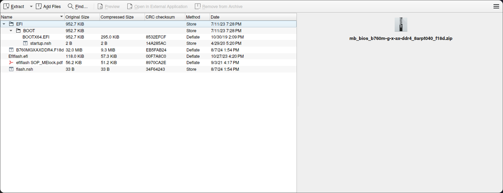
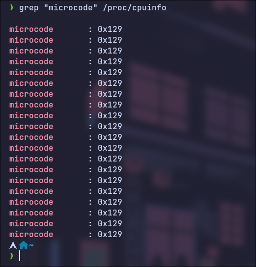
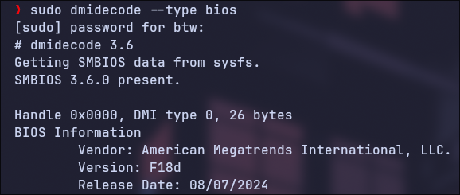

# What Happened?

**Intel have a major bug affecting all Intel 13th/14th Gen CPUs. This issue is critical, if not addressed, your CPU might experience severe performance gonna die or even dead. The problem stems from a voltage issue that causes excessive power, potentially leading to thread failures and eventual CPU death.** 

**>IMPORTANT!!! This is a permanent problem if left unresolved, so it's essential to update your BIOS to the latest version, which includes microcode 0x129 to fix this major bug.**

# Finding Your Latest BIOS Files

If you’re using the `B760M GAMING X AX DDR4 motherboard` like I am, you can download the latest BIOS from the official Gigabyte support page:

[Gigabyte B760M GAMING X AX DDR4 Support Page](https://www.gigabyte.com/Motherboard/B760M-GAMING-X-AX-DDR4/support#support-childModelsMenu)

For the `B760M GAMING X AX DDR4`, download the most recent BIOS version, which is labeled `F18d`.

### Steps to Download and Prepare Your BIOS File:

1. **Download the BIOS File:**
   - Go to the support page and download the latest BIOS file.

2. **Extract the ZIP File:**
   - The downloaded file will be named something like `mb_bios_b760m-g-x-ax-ddr4_8arpt040_f18d.zip`. Extract this ZIP file to reveal the BIOS update files.

    

3. **Transfer Files to USB Drive:**
   - Copy the extracted files onto a USB drive. Ensure that the USB drive is formatted to FAT32 for compatibility.

### BIOS Update Information

The BIOS update should include the following key improvements:

- **Update Microcode to 0x129:** Addresses sporadic Vcore elevation behavior, as announced by Intel.
- **Introduce "Intel Default Settings":** Enabled by default, this setting may need to be disabled to use GIGABYTE PerfDrive profiles effectively.

To update your BIOS, depending on your motherboard. For me it's Q-Flash to manually install the BIOS file you downloaded.

My previous BIOS version was F3, which was quite outdated. During the update process, the system will reboot several times. Note that it won't boot into the operating system until the update is complete. Once the update is finished, your system will boot normally.

## Checking the BIOS Version

After updating your BIOS, it’s crucial to verify that the CPU microcode version is `0x129` and the BIOS version is `F18d`. Here’s how you can check these details:

### 1. Check CPU Microcode Version

Run the following command in your terminal:

```shell
grep "microcode" /proc/cpuinfo # Check CPU microcode version
```

**Example Output:**



Make sure the output shows `microcode: 0x129` or something similar indicating the updated microcode version.

### 2. Check BIOS Version

To verify the BIOS version, use this command:

```shell
sudo dmidecode --type bios # Check BIOS version
```

**Example Output:**



Ensure that the output shows `BIOS Version: F18d` or a version that reflects the latest update.

## References

- [B760M GAMING X AX DDR4](https://www.phoronix.com/review/intel-raptor-lake-0x129)
- [July 2024 Update on Instability Reports on Intel Core 13th and 14th Gen Desktop Processors](https://community.intel.com/t5/Processors/July-2024-Update-on-Instability-Reports-on-Intel-Core-13th-and/m-p/1617113#M74792)
- [Megathread for Intel Core 13th & 14th Gen CPU instability issues](https://www.reddit.com/r/intel/comments/1egthzw/megathread_for_intel_core_13th_14th_gen_cpu/)
