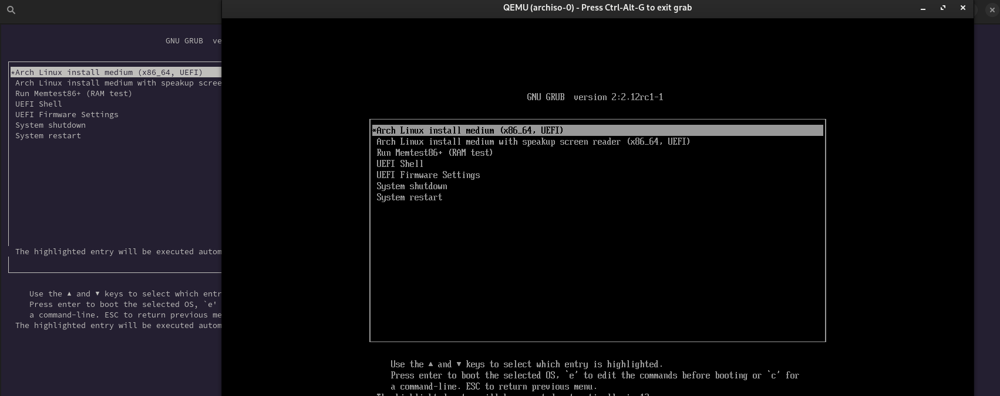
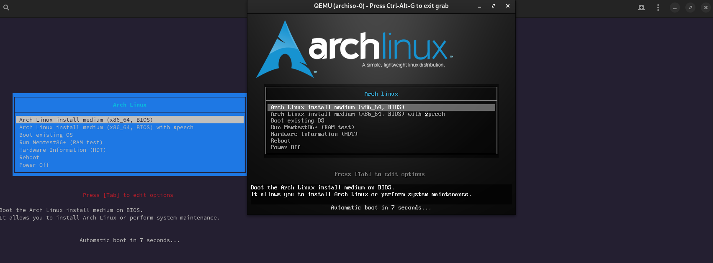

## What is Archiso?

Archiso is the official tool used to build the Arch Linux live CD/USB ISO images. It's a versatile utility that allows you to construct bootable ISO images that can be used for various purposes, from system recovery to creating your own personalized Arch Linux distribution or even your own Arch based Distribution.

## Why Archiso?

Have you ever wanted to create your own custom Arch Linux ISO image, tailored to your specific needs and preferences? With Archiso, a powerful and highly customizable tool, you can do just that. Whether you're building a rescue system, a Linux installer, or a specialized distribution, Archiso provides the framework to create ISO images that perfectly suit your requirements.

### Install Archiso

To start using Archiso, you need to install the package first.

```shell
sudo pacman -S archiso
```

### Create Working Directory

You will need a working directory to store your customizations and configurations. Create a dedicated directory where you'll carry out the customization process:

```shell
mkdir archlive
```

### Copy Your Configuration Files

To create a custom Arch Linux ISO, you'll need to copy the configuration files from the `/usr/share/archiso/configs/releng/` directory to your working directory. These files serve as the foundation for your custom ISO and contain essential settings and configurations. So that why you will need one arch linux system to copy the configuration files.

```shell
cp -r /usr/share/archiso/configs/releng/ archlive
```

### Building Arch Linux ISO

You can now start building your custom Arch Linux ISO by running the `mkarchiso` command. This command will generate the ISO image based on the configurations and settings you've defined in the `releng` directory.

To build your own Arch Linux ISO, create an `output` directory for the final image and a `work` directory for temporary files, then run `mkarchiso -v -o output work`, and if you need to rebuild, just delete the `work` directory and start the process again.

```shell
cd archlive
mkdir output work
```

And now you can start building the ISO by using the `mkarchiso` command.

```shell
sudo mkarchiso -v -w work -o output releng
```

### Monitor the Build Progress

During the ISO creation process, you'll see various messages indicating the progress of the build. These messages provide insights into the different stages being completed, such as package installation, file copying, and ISO generation.

The result will be like:

```shell
Written to medium : 408230 sectors at LBA 0
Writing to 'stdio:/home/username/your/path/here/archlive/output/archlinux-2023.08.27-x86_64.iso' completed successfully.
[mkarchiso] INFO: Done!
798M	/home/username/your/path/here/archlive/output/archlinux-2023.08.27-x86_64.iso
```

### Testing Your Custom Arch Linux ISO

The next step is to test your creation to ensure that it functions as intended. This testing phase allows you to identify any issues or discrepancies that may arise when booting the ISO on various systems. To facilitate this testing, you'll need to use the QEMU program along with the `qemu-desktop` package and the `edk2-ovmf` package for UEFI support (Firmware for Virtual Machines). install the required packages by executing the following command:

The testing environment can be form BIOS to UEFI mode, so you can test your ISO in both modes. To test your custom Arch Linux ISO in UEFI mode, follow these steps:

```shell
sudo pacman -S qemu-desktop edk2-ovmf
```

#### UEFI Mode Testing

To test your custom Arch Linux ISO in UEFI mode, use the following command:

 ```shell
run_archiso -u -i archlinux-2023.08.27-x86_64.iso
```



#### BIOS (Non-UEFI) Mode Testing

To test your custom Arch Linux ISO in BIOS mode, use the following command:

```shell
run_archiso -i archlinux-2023.08.27-x86_64.iso
```




### Customizing Your Arch Linux ISO Packages

One of the key benefits of creating a custom Arch Linux ISO is the ability to include specific packages that align with your needs and preferences. You can customize the list of packages included in your ISO by editing the `packages.x86_64` file located in the `releng` directory. This file contains a list of packages that will be installed on the ISO image.

```shell
nvim releng/packages.x86_64
```

## Conclusion

In this guide, you've learned how to build your own custom Arch Linux ISO using the powerful `mkarchiso` tool. By following the steps outlined in this tutorial, you've gained the ability to create an ISO image that perfectly aligns with your needs and preferences. This process empowers you to customize the Arch Linux experience to a level that the official ISOs might not offer.

This also is a great way to start creating your very own Arch-based distribution, tailored to your specific requirements. Whether you're building a specialized system, a rescue disk, or a Linux installer, Archiso provides the flexibility and control you need to create a custom Arch Linux ISO that meets your unique needs.

## Resources

- [Archiso](https://wiki.archlinux.org/title/archiso)
- [Arch Linux: Create Your Own Installer](https://www.youtube.com/watch?v=-yPhW5o1hNM)
- [Build Your Own Distro With Archiso](https://www.youtube.com/watch?v=tSGGBbJBgvk)
