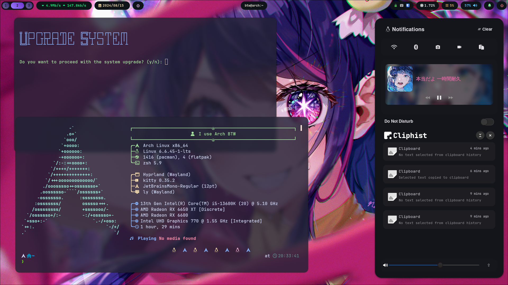

## UmmIt thank you!

First of all, I really appreciate you using my dotfiles or checking them out on Reddit, YouTube, or elsewhere. This article is for users who want to use my dotfiles, and I’ll cover everything you need to know.

I’ve had some people asking how to set up their system like mine, so I decided to share the process with you.

This article is mainly for newcomers to Hyprland.



## Want the Same Look as in the Image?

Achieving this is quite straightforward. If you prefer not to use the installation script, I understand. Some users prefer not to run scripts on their system. even everything is fully open source and based on a bash script, so i decided to write this guide.

1. **Install the Required Packages**

```shell
sudo pacman -S zsh kitty neovim cliphist clipmenu \
ly hyprland hyprlock hypridle xdg-desktop-portal-hyprland \
ttf-jetbrains-mono ttf-jetbrains-mono-nerd papirus-icon-theme \
waybar fuzzel fastfetch wf-recorder swaync \
pulseaudio pavucontrol alsa-plugins lib32-alsa-plugins lib32-alsa-lib
```

## What Do These Packages Do?

To fully set up your system, you need both Pacman and AUR.

### Pacman Packages

- **zsh**: The shell prompt (install with Pacman)
- **kitty**: The terminal emulator (install with Pacman)
- **neovim**: The editor (install with Pacman)
- **cliphist** and **clipmenu**: Clipboard managers (install with Pacman)
- **ly**: Display manager (install with Pacman)
- **hyprlock**: Lock management (install with Pacman)
- **hypridle**: Idle management (install with Pacman)
- **JetBrains Mono**: Fonts (install with Pacman)
- **Papirus**: Icon theme (install with Pacman)
- **waybar**: Status bar (install with Pacman)
- **fuzzel**: Application launcher (install with Pacman)
- **fastfetch**: System information tool (install with Pacman)
- **wf-recorder**: Screen recorder (install with Pacman)
- **swaync**: Notification daemon (install with Pacman)
- **Pulseaudio**: Audio server (install with Pacman)

### AUR Packages

For AUR packages, I recommend using `yay`.

```shell
yay -S wlogout swww hyprshot hyprswitch hyprpicker emote
```

## Manually Copy Guidelines

If you’ve already installed the required packages, you’re ready to set up my dotfiles. Start by cloning the repository:

```shell
git clone https://github.com/UmmItC/Dotfiles.git
```

Next, navigate into the cloned dotfiles directory:

```shell
cd Dotfiles
```

There are two key directories in the dotfiles repository: `configs` and `scripts`.

- **`configs`**: Contains all my configuration files and CSS.
- **`scripts`**: Includes bash scripts for the launcher, such as the wallpaper picker and wf-recorder on Swaync.

Navigate into the `configs` directory. Here are the main directories you might want to copy:

- **fastfetch**
- **fuzzel**
- **hypr**
- **kitty**
- **swaync**
- **waybar**

Other configurations are optional. You can ignore these if you prefer.

To copy the desired configurations into `~/.config`, use the following commands:

```shell
cp -rv fastfetch ~/.config
cp -rv hypr ~/.config
cp -rv kitty ~/.config
cp -rv swaync ~/.config
cp -rv waybar ~/.config
```

For `zsh` and `powerlevel10k` configurations, they are typically generated automatically. It’s best to generate these yourself to keep them up-to-date.

Make sure to add `fastfetch` to your `~/.zshrc` or `~/.bashrc`, without that, you will not be able to view fastfetch on your terminal once it has started.

```shell
fastfetch --show-errors --pipe false
```

For the Hyprland configuration, you should modify the keybindings in `~/.config/hypr/hyprland/keybinds.conf`. Adjust the values to suit your preferences.

### Copy the Shell Scripts

In this section, you’ll find scripts for various tools: clipboard manager, Hyprlock, Hyprpicker, Swaync, SWWW, and Waybar.

1. **Clipboard Manager**

   For the clipboard manager, the script is stored in `cliphist`. This file serves as the launcher for the clipboard manager.

2. **Hyprlock**

   The Hyprlock script controls when the lock screen activates. Since I use GPU passthrough for my second GPU, I encountered issues when the second GPU was in use by VMs. The Hyprlock script manages these conditions to prevent system problems.

3. **Swaync**

   This script works with `wf-recorder`. It includes a toggle button for Swaync to control `wf-recorder`.

4. **SWWW**

   `swww` is the wallpaper picker. The default path for wallpapers is `~/.wallpaper`. Place your images in this directory, and the wallpaper picker will automatically detect and load them when launched. You can activate it using `ALT_L + W`.

5. **Waybar**

   The Waybar script is designed to upgrade your system. It includes updates for:

   ```shell
   sudo pacman -Syuv
   yay -Syuv
   ~/.oh-my-zsh/tools/upgrade.sh
   git -C $HOME/powerlevel10k pull
   flatpak update -v
   ```

   This script ensures that your system packages and configurations are up-to-date.
