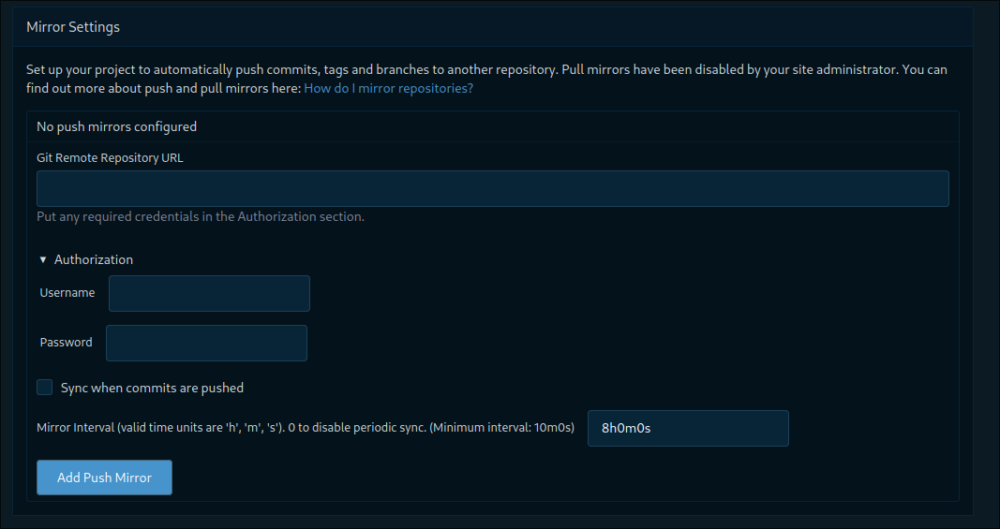

## Introduction

Setting up a mirrored repository simplifies collaboration and enhances version control. Here's a straightforward guide to help you get started:

>This aritcle force on my workflow. Codeberg mainly repository and the gitlab mirror repository. But with others, just some differtent, you can easily find out the section.

### Step 1 - Generate an Access Token

Obtain an access token key from your target DevSecOps platform, such as GitLab, GitHub, or others. For GitHub, you can use [this URL](https://gitlab.com/-/user_settings/personal_access_tokens). Ensure that the token has all the necessary scopes, considering this repository is under your full control.

### Step 2 - Configure Mirror Settings

Navigate to the settings of your existing code repository on Codeberg. Look for the `Mirror Setting` section.

- **Git Remote Repository URL:** Provide the remote URL of your empty mirror repository.
- **Authorization:** Enter the username of your mirror repository and the access token key associated with the account.
- **Sync when commits are pushed:** Enable this option for automatic synchronization when commits are pushed to the source repository.
- **Mirror Interval:** Choose a suitable interval for syncing. The default is often set to 8 hours.

### Step 3 - Add Push Mirror

Once you've ensured that all the information is correct, click on "Add Push Mirror."

### Step 4 - Initiate Synchronization

Click `Synchronize` to force a sync for the first time. Be patient and wait a few minutes.

### Step 5 - Verification

Check your GitLab mirror repository. You should observe the source tree syncing with the mirrored repository, indicating a successful setup.

Now, with these steps, you've established a mirrored repository, enhancing the efficiency of your DevSecOps workflow. Enjoy seamless collaboration and version control!

## Conclusion

Remember. The place where you have the code is where you enter the password you need for your other DevSecOps account. Once you have entered it correctly, remember to go back to the mirror setting to check the status. If there are any errors, you will get a corresponding error. So you might have entered the wrong value. Just check it again.
