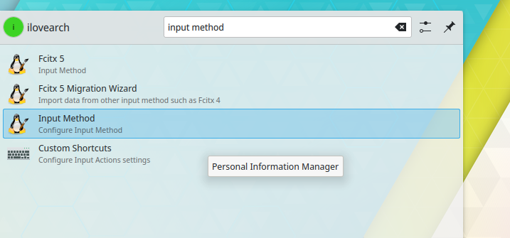
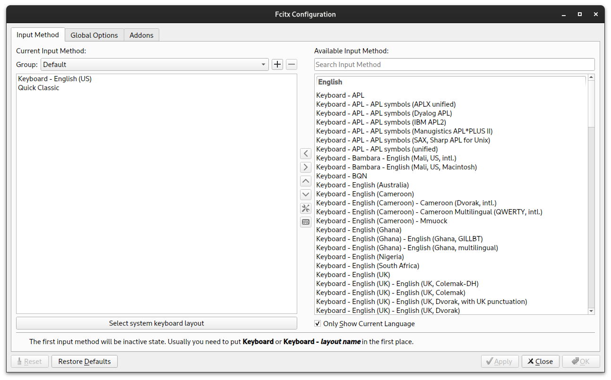

## Fcitx5 Introduction

Fcitx5, the successor to Fcitx, is a lightweight input method framework for Linux. Offering additional language support through various addons, it enhances your typing experience on Linux systems. This guide will walk you through the installation process and configuration steps for Fcitx5.

### Install Fcitx5 and Required Addons

If you're using Arch Linux and wish to type in languages other than English, such as Chinese and Japanese, installing Fcitx5 is essential. Open your terminal and run the following command:

```shell
sudo pacman -S fcitx5-chinese-addons libime fcitx5 fcitx5-table-extra
```


#### KDE Support

For KDE users, you may need to install the necessary KCModule for fcitx5. Run the following command:

```shell
sudo pacman -S kcm-fcitx5
```


#### Support Program Windows

To ensure comprehensive language support across various programs, install libraries for technologies used by different applications. Execute the following command:

```shell
sudo pacman -S fcitx5-qt fcitx5-gtk fcitx5-im
```


### Environment variables to 

```shell
sudo nano /etc/environment
```

Paste the following lines:

```shell
export GTK_IM_MODULE=fcitx
export XMODIFIERS=fcitx
export QT_IM_MODULE=fcitx
export SDL_IM_MODULE=fcitx
```


## Configuring Input Methods

### Add New Input Method

Click the search input method icon in the lower right corner to open the input method configuration.



#### For KDE Users

Press `+ Add Input Method` in the lower right corner, find the desired input method, and press `ADD`.

>Note: If you're using Quick, Please search Quick Classic in the textbox. 


#### Except KDE Users

Unless you are using KDE DE, you will need to use the fcitx5 config tool, otherwise you will not see fcitx5 in your input method options.

And so, using fcitx5-tool directly is the best way to go.

```shell
sudo pacman -S fcitx5-configtool
```

Search for `fc` and open the tool. Select `Quick Classic` using the arrow and press `ADD`.



## Logout

After completing the above steps, log out of your session.


## Check System Configuration

Type the following command to verify the system configuration:

```shell
echo $GTK_IM_MODULE
```

If `fcitx5` is displayed, the configuration was successful.

## Font Problem and Solution

If you encounter font display issues, particularly garbled characters, install a Chinese font package. Run the following command:

```shell
sudo pacman -S wqy-zenhei
```


After installed the package, you need to reboot again to apply the fonts, then you should see the improved character rendering without garbled text! :D

# References

- [Arch Linux - Simplified Chinese Localization](https://wiki.archlinux.org/title/Localization/Simplified_Chinese?rdfrom=https%3A%2F%2Fwiki.archlinux.org%2Findex.php%3Ftitle%3DLocalization_%28%25E7%25AE%2580%25E4%25BD%2593%25E4%25B8%25AD%25E6%2596%2587%29%2FSimplified_Chinese_%28%25E7%25AE%2580%25E4%25BD%2593%25E4%25B8%25AD%25E6%2596%2587%29%26redirect%3Dno)
- [ProgrammerAll - Fcitx5 Installation Guide](https://www.programmerall.com/article/6459746231/)
- [YouTube Video Tutorial](https://www.youtube.com/watch?v=yXSDJWtGeKY)
