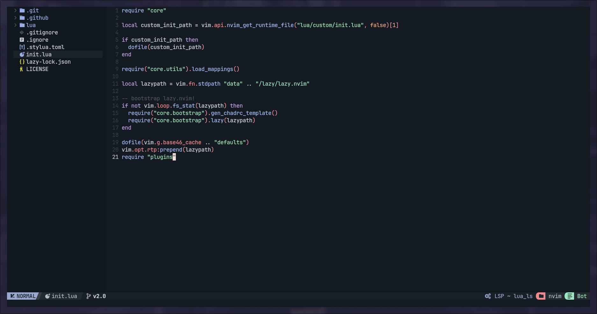

## Overview

Have you try to use Neovim as your IDE? that might be difficult for the first initial setup. But, with NvChad, you can easily turn Neovim into a full-featured IDE with just one command. after that, you also can install various plugins that you need.

### What's NvChad?

NvChad is a community-driven Neovim setup that provides a comprehensive IDE experience. It includes various features. You can just say it's a full-featured IDE of vscode.

## Installation

Begin to install NvChad, Please ensure you have Neovim installed, Also for To avoid appearing error, please rmove any existing configurations.

```shell
rm -rfv ~/.local/share/nvim
```

Then, install NvChad using:

```shell
git clone https://github.com/NvChad/starter ~/.config/nvim
```

after that, open Neovim and run:

```shell
nvim
```

and now will be automatically install all the plugins that required by NvChad.

## NvChad usage

NvChad provides various features and shortcuts to enhance your Neovim experience. Here are some of the most useful ones:

### Theming

NvChad provides various themes. To access them, press `Space` + `t` + `h` in Neovim and choose from the available options.

### Syntax Highlighting

For language syntax highlighting, manually install supported languages. In Neovim, use:

```shell
:TSInstall css html javascript
```

This example installs support for CSS, HTML, and JavaScript.

Check installed syntax highlighting using:

```shell
:TsInstallInfo
```

### File Tree and Shortcuts

Navigate the file tree with `Ctrl` + `n`. Useful shortcuts include:

- Select file: Arrow keys
- Open file: `Enter`
- Delete file: `d`
- Create directory/file: Press `a`, enter name
- Copy directory/file: `c`
- Paste directory/file: `p`
- Rename directory/file: `r`, enter name

## Finding Files

Use `Space` + `f` + `f` to search for files.

## Cheatsheet

Access the NvChad cheatsheet with `Space` + `c` + `h`.

## Result

I can't think of any other word. Its just wondeful.

>What are the reasons need vscode? Just Deleteing VSCode lmfao


    
## References

- [Turn VIM into a full featured IDE with only one command](https://yt.cdaut.de/watch?v=Mtgo-nP_r8Y)
- [NvChad](https://nvchad.com/)
