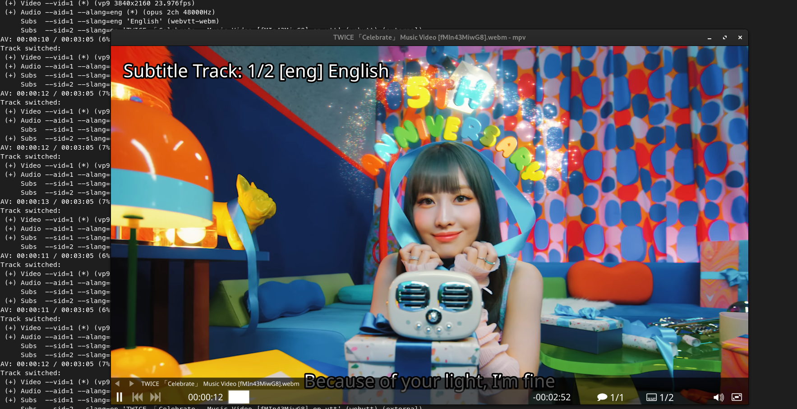
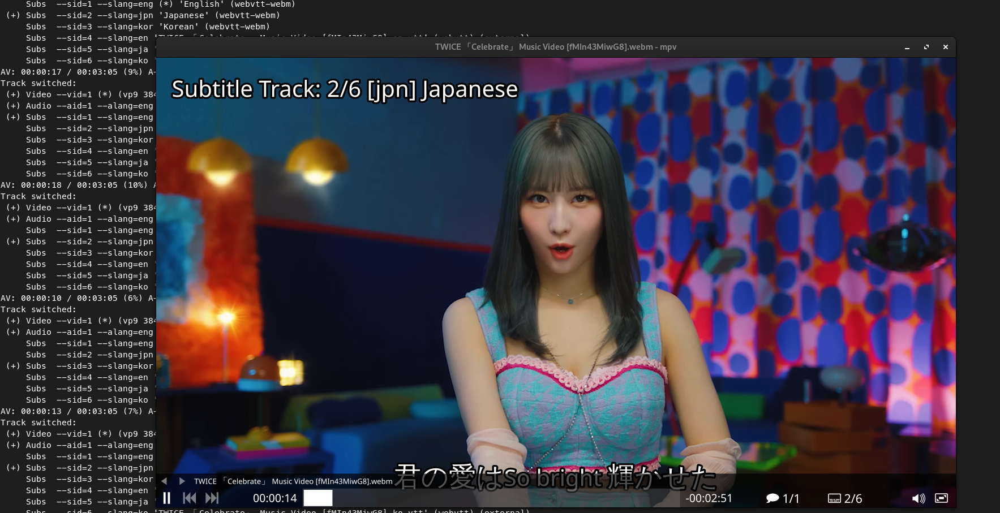
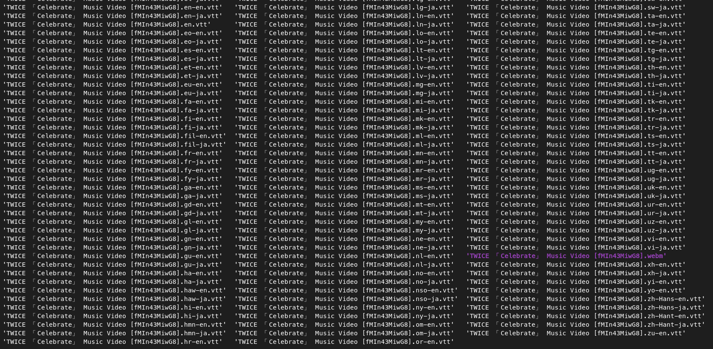

## Introduction

In the age of information and content sharing, videos and audio recordings have become an integral part of our digital lives. Whether you're an educator, a content creator, or simply someone who loves consuming media, having the ability to download and manage media files is essential. Enter yt-dlp, an advanced command-line tool designed to make video and audio downloading a breeze. In this guide, we'll walk you through the process of using yt-dlp's command-line tools to download videos, audio tracks, and customize number formats for a more organized media library.

## What is yt-dlp?

yt-dlp is an enhanced command-line utility that enables you to download videos and audio from various streaming platforms, with YouTube being the most prominent. As a fork of youtube-dl, yt-dlp brings new features, bug fixes, and ongoing development to ensure a robust and reliable video downloading experience. With a wide array of customization options and enhanced functionality, yt-dlp is a powerful tool for users who desire more control over their video downloading process.

## Installation Made Easy

Getting started with yt-dlp's command-line tools is a breeze, thanks to its straightforward installation process across various platforms. Whether you're a Linux aficionado, a macOS enthusiast, or a Windows devotee, yt-dlp ensures a seamless setup experience. Let's explore the installation steps for different operating systems:

### Debian/Ubuntu:

If you're using a Debian-based Linux distribution, such as Debian or Ubuntu, installing yt-dlp is a easy. Open your terminal and enter the following commands:

```bash
sudo apt-get update
sudo apt-get install yt-dlp -y
```

### Arch Linux:

Arch Linux users can take advantage of the Arch User Repository (AUR) to install yt-dlp. Simply open your terminal and use your preferred AUR helper, like yay, with the following command:

```bash
sudo pacman -S yt-dlp
```

### macOS:

Mac users can utilize the Homebrew package manager for a seamless installation process. Launch your terminal and execute the following command:

```bash
brew install yt-dlp
```

### Windows:

Windows users can benefit from the scoop package manager. Open your command prompt and enter the following command:

```bash
scoop install yt-dlp
```

## Mastering yt-dlp's Command Line Tools

Now that yt-dlp is at your disposal, let's dive into its command line options to explore the diverse range of tools it offers for media downloading. Whether you're seeking high-quality video downloads, audio extraction, or personalized file naming, yt-dlp has you covered.

### Simple and Straightforward Video Download

For a quick and straightforward video download without additional commands, use the following:

```bash
yt-dlp [video URL]
```

Replace `[video URL]` with the actual URL of the video you want to download. yt-dlp will fetch the video and save it in your current directory.

### Listing Video Formats

To view available video formats and their details, you can use the following command:

```shell
yt-dlp -F [video URL]
```

This command provides a detailed list of available formats, including resolution, file size, codecs, and more. The output helps you choose the desired format for your download.

#### Targeting Specific Format ID

After listing the available formats, you can target a specific format ID to download the video in that format. Higher numbers generally indicate better quality:

```shell
yt-dlp -f 248+251 [video URL]
```

This command selects the video (ID 248) and audio (ID 251) formats, merging them into a single file.

### Targeting Specific Extension Type

If you prefer a specific extension type, such as mp4, you can use:

```shell
yt-dlp -f mp4 [video URL]
```

This command filters the formats to include only those with the mp4 extension, simplifying your download preferences.

### Extracting Audio for On-the-Go Listening

Sometimes, you might only be interested in the audio content of a video, especially for music tracks, lectures, or podcasts. yt-dlp makes this task a breeze. To extract audio from a video, follow these steps:

```bash
yt-dlp --extract-format --audio-format mp3 [video URL]
```

This command tells yt-dlp to extract the audio ( `--extract-format` or `-x`) and convert it to the MP3 format (`--audio-format mp3`).

### Batch Downloading with `-a` Option

yt-dlp's command-line tools extend beyond individual video downloads. With the `-a` option, you can take advantage of batch downloading by providing a text file containing multiple video URLs, each on a separate line. This feature is incredibly useful when you have a list of videos you want to download efficiently. Here's how you can do it:

1. **Create a Text File**: Open a text editor and create a new file. Paste the URLs of the videos you want to download, with each URL on a separate line. Save the file with a meaningful name, such as `video_list`.

2. **Terminal**: Open your terminal or command prompt.

3. **Batch Download Command**: Use the `-a` or `--batch-file` option along with the path to your text file to initiate the batch download:

   ```bash
   yt-dlp -a path/to/video_list
   yt-dlp --batch-file path/to/video_list
   ```

>Tips: Replace `path/to/video_list` with the actual path to your text file.

yt-dlp will sequentially download each video listed in the text file, ensuring a hassle-free and efficient batch downloading process. This approach is particularly valuable when you want to download an entire playlist, multiple lectures, or a series of videos without having to enter each URL individually.

## Chapter Handling

In the vast realm of online video content, having the ability to navigate through different sections of a video seamlessly can greatly elevate the viewer's experience. Whether you're watching educational tutorials, conference talks, or your favorite entertainment, having chapter markers can make it easier to jump to specific parts of the video. yt-dlp, an advanced command-line downloader for various media sites, introduces two remarkable features for managing chapters in videos: `--embed-chapters` and `--split-chapters`. Let's delve into how these features work and how they can transform your video consumption.

### Embed Chapters

The `--embed-chapters` option in yt-dlp empowers you to embed chapter markers directly into the video file itself. This integration transforms chapters into an inherent element of the video, enabling easy access through media players that support chapter navigation. Here's how to harness this feature:

```shell
yt-dlp --embed-chapters [video URL]
```

Upon executing this command, yt-dlp downloads the video and incorporates the chapter markers. When you play the video in a compatible media player, you'll encounter a list of chapters, allowing you to effortlessly jump to any section with a single click.

This functionality proves invaluable for educational content, conference presentations, and lengthy videos, enabling you to skip directly to specific topics without the inconvenience of manual navigation.

### Splitting Videos with Chapter Precision

The `--split-chapters` option in yt-dlp takes chapter handling to a new echelon, enabling you to divide a video into multiple files based on its internal chapters. This feature is ideal for scenarios where you want to watch individual chapters as standalone videos. Here's the mechanism:

```shell
yt-dlp --split-chapters [video URL]
```

Following the video download, yt-dlp automatically segments it into distinct files, each corresponding to a chapter. This approach enables you to enjoy each chapter as a separate video without requiring manual trimming or editing of the original content. It's an efficient way to consume videos when your interest lies solely in specific sections.

### Subtitle Management

yt-dlp extends its capabilities to handle subtitles effortlessly, simplifying the process for users. The `--list-subs` option proves to be a handy tool in this regard.

```bash
yt-dlp --list-subs [video URL]
```

Executing this command provides a detailed list of subtitle formats along with their respective names.

```shell
Language   Name                                Formats
en                                             vtt
ja                                             vtt
ko                                             vtt
af-en      Afrikaans from English              vtt, ttml, srv3, srv2, srv1, json3
ak-en      Akan from English                   vtt, ttml, srv3, srv2, srv1, json3
sq-en      Albanian from English               vtt, ttml, srv3, srv2, srv1, json3
...

[info] Available subtitles for fMIn43MiwG8:
Language Name     Formats
en       English  vtt, ttml, srv3, srv2, srv1, json3
ja       Japanese vtt, ttml, srv3, srv2, srv1, json3
ko       Korean   vtt, ttml, srv3, srv2, srv1, json3
```

It's crucial to note that this is the first of two listings and primarily contains auto-generated subtitles. For the main subtitles, written by humans, refer to the final list. In the given example, only three subtitles (en, ja, ko) were crafted by a human for the video.

#### Downloading Language-Specific Subtitles and Embedding Them

Download subtitles in a specific language and embed them into the video with the following command:

> Tip: If the video lacks any subtitles, don't worry. yt-dlp will automatically ignore this.

```shell
yt-dlp --write-sub --embed-sub --sub-lang en [video URL]
```

This command specifies the language ID as `en`. The resulting subtitle file (vtt) will share the same name as the video file, facilitating automatic recognition by the mpv player.



#### Downloading All Available Subtitles (Excluding Auto-Gen)

This method fetches all non-auto-generated subtitles for the video:

```shell
yt-dlp --write-sub --embed-sub --all-subs [video URL]
```



#### Downloading Auto-Gen Subtitles

yt-dlp facilitates the download of auto-generated subtitles as well:

```shell
yt-dlp --write-auto-sub --embed-sub --all-subs [video URL]
```



#### Thumbnail Management

With yt-dlp also has a feature for thumbnail, Here are base usege:

>Note: This features require FFMPEG to embed.

```shell
yt-dlp --embed-thumbnail [video URL]
```

#### Metadata Management

This option are disable by default, metadata are information data of this video. but if you want you can just adding `--add-metadata` or `--embed-metadata`, For example:

```shell
yt-dlp --add-metadata [video URL]
yt-dlp --embed-metadata [video URL]
```

### Download some only

How about only dowload subtitle or Thumbnail? with yt-dlp you can easily do it with `--skip-download`, For instance:

```shell
yt-dlp --write-thumbnail --skip-downoad [video URL]
```

`--write-*` can be interpreted as a download file. Same to subtitle, if you without `--write-sub` only place `--embed-sub ...` that will only embed the subtitle into video. Not including download subtitle file.

### Lots of videos (like lists/channels)

By default, you dont have worries how differernt with downloading lots of  videos. No need adding any command for this.

```shell
yt-dlp [channel URL]
yt-dlp [playlist URL]
```

### Playlist Management with yt-dlp

Efficiently managing playlists is a breeze with yt-dlp, offering a range of commands to tailor your downloads. Explore these commands for seamless playlist management:

- `--playlist-start [NUMBER]`: Begin downloading from the specified item number.
- `--playlist-end [NUMBER]`: Conclude downloading at the specified item number.
- `--playlist-items [NUMBER]`: Download specific items from the playlist.
- `--max-downloads [NUMBER]`: Limit the total number of downloads.

These commands provide granular control, enabling you to customize your download preferences for specific items or ranges within a playlist.

#### Download a Specific Range of Items

To download a specific range of items, utilize the `--playlist-start` and `--playlist-end` options. For example, to download items from the third to the seventh in the playlist:

```shell
yt-dlp --playlist-start 3 --playlist-end 7 [playlist URL]
```

#### Download a Specific Range (Starting Point)

If you only specify the starting point, yt-dlp will download from that point onward:

```shell
yt-dlp --playlist-start 3 [playlist URL]
```

#### Download a Specific Range (Ending Point)

Similarly, specifying only the ending point results in downloading from the first item up to the specified point:

```shell
yt-dlp --playlist-end 20 [playlist URL]
```

#### Download Specific Items

Replace `[range]` with your desired number format, such as `1-10` or `5,8,12-15`. This option ensures that your downloaded files are numbered according to your preference, making organization and navigation a breeze.

```bash
yt-dlp --playlist-items [range] [playlist URL]
```

#### Limit the Total Number of Downloads

To cap the total number of downloads from the playlist, employ the `--max-downloads` option. For instance, to download a maximum of 10 items:

```shell
yt-dlp --max-downloads 10 [playlist URL]
```

### Output Naming Options

yt-dlp offers flexible options for specifying the output names of downloaded videos using the `-o` or `--output` parameter.

#### Remove ID (with Format)

By default, the output name includes the YouTube title name and video ID. To exclude the ID, use the following format:

```shell
yt-dlp -o %(title)s.%(ext)s
```

#### Output with Your Name

You can customize the output name by specifying your desired name:

```shell
yt-dlp -o "Example" [video URL]
```

This results in the video being named `Example.webm`.

#### Output with Your Name + Custom Extensions

If you want a specific format like MP4, you can customize both the name and extension:

>Note: Ensure the specified file extension corresponds to the actual video format. If not, you may need to use ffmpeg to convert the downloaded video.

```shell
yt-dlp -o "Example.mp4" [video URL]
```

#### Output with ID Only

If you prefer the output name to include only the video ID:

```shell
yt-dlp --id [video URL]
```

The resulting output name could be something like `C-o8pTi6vd.webm`.

### Proxy Management

You can use a proxy to download videos, which can be useful for accessing videos limited to specific countries. Find a suitable proxy IP from a provider like [VPNOverview](https://vpnoverview.com/privacy/anonymous-browsing/free-proxy-servers/) and use it in yt-dlp:

```shell
yt-dlp --proxy [IP] [video URL]
```

### IP Protocol (v4, v6)

Control whether to use IPv4 or IPv6 with these options:

For IPv4:

```shell
yt-dlp -4 [video URL]
yt-dlp --force-ipv4 [video URL]
```

For IPv6:

```shell
yt-dlp -6 [video URL]
yt-dlp --force-ipv6 [video URL]
```

### Source Client IP

Specify the source client IP with:

```shell
yt-dlp --source-address [IP] [video URL]
```

### Limit Download Speed

Control the download speed to avoid impacting your network. For example, to limit the speed to 100K:

```shell
yt-dlp --throttled-rate 100K [video URL]
```