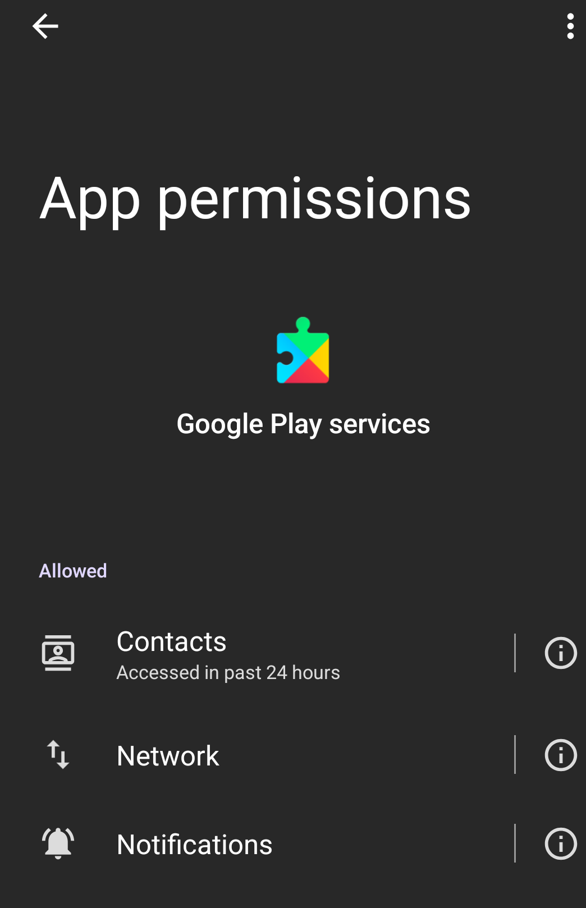

## Story

Today, I decided to use WhatsApp on my GrapheneOS device as my main device, rather than just linking it to my old phone. Previously, I had only linked my GrapheneOS to access WhatsApp, but I realized that I was missing out on several features, particularly the backup feature, which required my old device to be turned on. I wanted to keep my old device off, as it was essentially just serving as a second clock. Additionally, I noticed that I couldn't download images and videos on my GrapheneOS device because it was set up as a linked device. So, I made the switch to make GrapheneOS my primary WhatsApp device.

However, I encountered a problem when trying to restore my chat history from Google Drive. During the restore process, I couldn't see my Google account, no matter how many times I logged in again. Frustrated, I turned to the internet for solutions on how to restore my chat history on GrapheneOS.

After some research, I discovered that the issue was actually quite simple. The problem stemmed from permission restrictions on GrapheneOS. Specifically, Google Play Services needed the appropriate permissions to access my contacts.

Through this article, I want to share the solution I found for restoring chat history from Google Drive on GrapheneOS. By ensuring that Google Play Services has the necessary permissions, you can successfully restore your WhatsApp chats and enjoy all the features that come with using WhatsApp as your main device.

### Quick Guide

Let’s assume you have a GrapheneOS device and have installed WhatsApp through the GrapheneOS Google Play Mirror. If you want to restore your chat history from Google Drive, here’s a quick guide to help you through the process:

1. **Install Google Play Services**: Make sure you have the sandboxed version of Google Play Services installed on your GrapheneOS device.

2. **Grant Permissions**: 
   - Go to Settings > Apps > Google Play Services.
   - Ensure it has access to contacts and storage.

3. **Backup on Old Device**: On your old device, back up your WhatsApp chats by going to WhatsApp settings > Chats > Chat backup.

4. **Install WhatsApp**: Download and install WhatsApp on your GrapheneOS device.

5. **Restore Chats**: 
   - Open WhatsApp and verify your phone number.
   - Follow the prompts to restore your chat history from Google Drive.
   - Now you should be able to see your Google account during the restore process.

6. **Finish Setup**: Complete the setup process and you should have your WhatsApp chats restored on your GrapheneOS device.

### Example of GrapheneOS Google Play Services Permission

## Disable Google Play Services Permission

I’ve noticed that the contacts permission for Google Play Services plays a crucial role in Google login detection. You can enable this permission when you need to log into any Google service, so you won’t have to log in manually again, as you’re already logged in through Google Play Services. The key point is to only allow the permission to access contacts when necessary.

Moreover, I recommend disabling this permission after you finish the restore process because Google Play Services doesn’t need access to your contacts afterward. It’s a good practice to limit the permissions granted to Google Play Services.

The permission only needs to be granted during the restore process. After that, you can disable it. Once you've restored your chats, you can back them up again without any issues. You can safely disable the contacts permission for Google Play Services afterward.

## Thanks for the solution links:

[WhatsApp cannot see Google account for cloud recovery #1122](https://github.com/GrapheneOS/os-issue-tracker/issues/1122). (n.d.). GitHub. Retrieved October 10, 2023, from https://github.com/GrapheneOS/os-issue-tracker/issues/1122
