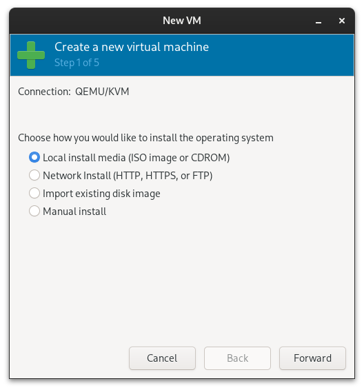
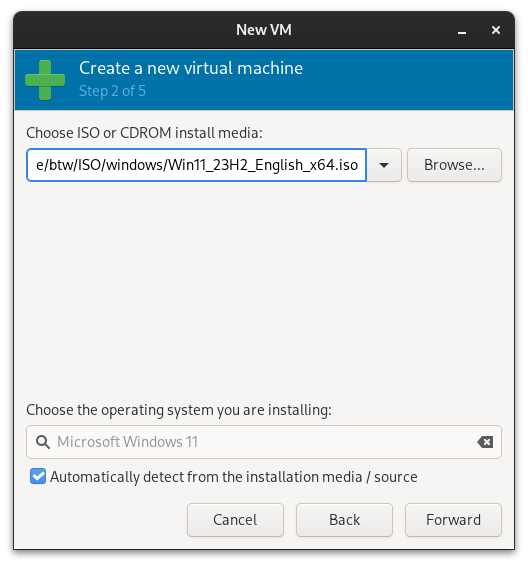
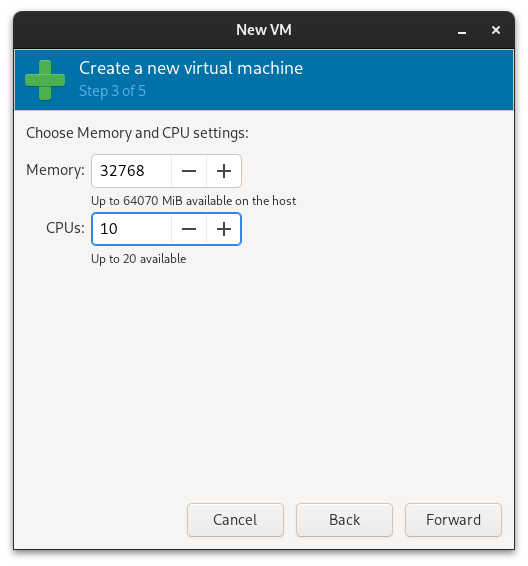
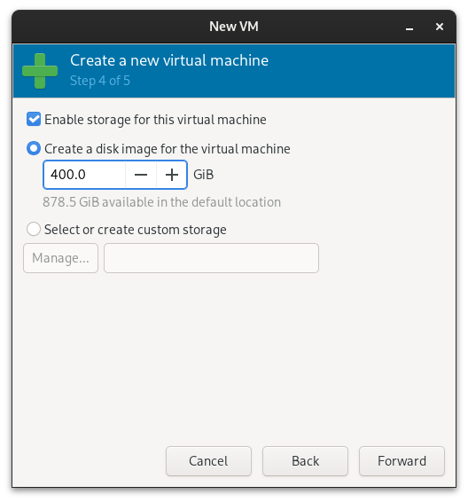
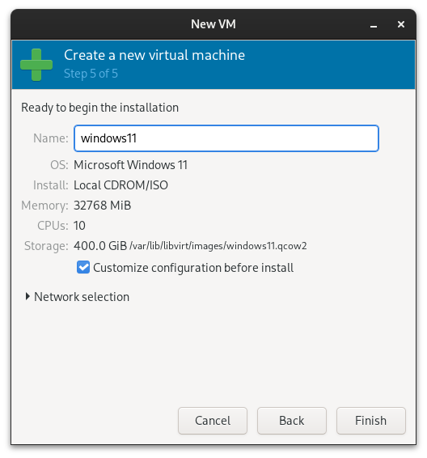

## Introduction

Windows 11 introduces a modern interface and various features to the Windows operating system. However, installing Windows 11 on a virtual machine, particularly dealing with the TPM 2.0 requirement, can be challenging. In this guide, we'll take you through the process of installing Windows 11 on QEMU/KVM virtualization, complete with a virtual TPM solution. This enables you to experience Windows 11 on systems lacking native TPM support.

## Before You Begin

Ensure you've completed the crucial steps outlined in our comprehensive guide:

### 1. Dual GPU Passthrough Guide - Part 1 to Part 6

This guide provides essential details on configuring your Linux system for virtualization, significantly enhancing your Windows 11 installation experience.

Read Part 1 to Part 6: [Tags gpu-passthrough](/tags/gpu-passthrough/)

### 2. Secure Boot Must Be Enabled

Refer to this [guide](/posts/en/linux/system/uefi/secure-boot/how-to-enable-secure-boot-with-self-cert/) to enable Secure Boot on your Linux machine, as Windows 11 requires Secure Boot.

## Step 1: Installing Required Packages

After successfully configuring, install the necessary packages for setting up the virtual TPM. Open your terminal and execute the following command:

```bash
sudo pacman -S swtpm
```

These packages provide the components required to create a virtual TPM for Windows 11 installation.

## Step 2: Create New VM

1. In the VM manager, create a new VM. Select `Local Install media`.



2. Choose your Windows ISO.



3. Configure memory and CPU settings.



4. Enable storage for this VM.



5. Name your VM and click `Customize configuration before install`.



## Step 3: Virt-manager Configuration

Now, configure the Firmware, CPU, and other settings:

1. In the Overview section, select `Firmware` to `UEFI x86_64: /usr/share/edk2/x64/OVMF_CODE.secboot.fd`.


2. CPUs: Set the CPU configuration to `host-passthrough`. Enable `Copy host CPU configuration (host-passthrough)`, `Manually set CPU topology`, and select your preferred number.


3. VirtIO Disk: Create a storage for `VirtIO`, set it to `40GB`, and configure the bus type as `VirtIO` with the device type as `Disk device`.


4. VirtIO ISO: Create a storage for `VirtIO ISO` and set it to CDROM device.


5. Boot Options: Set `SATA CDROM 1` to the top. This storage contains the Windows 11 ISO, making it the primary boot option.

6. TPM: Add a TLS and version 2.0 of the TPM.


7. Remove NIC: Remove the NIC to install Windows offline, bypassing Microsoft Account requirements during installation. You can later use the command-line to proceed without connecting to the network.

## Step 4: Booting into System

Click the `Begin Installation` button to start the machine. If you miss the prompt to press any key for Windows 11 ISO boot-up, follow these steps:

1. **UEFI Shell:** The Shell automatically loads. Type `exit` and press `Enter` to leave the BIOS menu.


2. After exiting, use the arrow keys to navigate. Select `Boot Manager`.


3. Enter the first option. The UEFI DVD-ROM should be the first one if you followed my steps.


4. Press any key to launch the Windows 11 ISO.


## Step 5: Windows Setup

Now, you should see the Windows setup page. Follow these steps:

1. **Language and Settings:** Select your preferred language, time, and keyboard layout. Click next.


2. Click `Install now`.


3. Click `I Don't have the product key`.


4. **Select Windows 11 Pro:** Choose the Pro version for additional features. Click `Next`.


5. Accept the LICENSE.


6. **Custom Installation:** Apply the VirtIO Driver. Select `Custom: Install Windows only (advanced)`.


7. **Load Driver:** Click `Load driver`.


8. **Browse:** Click `Browse`.


9. Find the Win11 driver at `E:\amd64\w11`. Click OK.


10. After the driver loads, select the REDHAT result. Click `Next`.


Wait for the driver installation to complete.


11. After setup, install drivers on your disk (e.g., `400GB`).


12. The Windows installation will reboot several times. Ignore the `Press any key` prompt; it's part of the installation process.


When you see the `Hi` screen, the Windows installation is almost finished.

## Step 5: Personal Configuration Setup with Offline

Now, you should see the section showing the Country select page. Press `Shift + F10` to launch `cmd` and type:

```cmd
OOBE\BYPASSNRO
```

After entering the command, the system will automatically reboot. Once your system boots up again, you can proceed with the final installation steps.


## Step 6: Power Off the System

Congratulations! Windows 11 installation is complete.


Power off your system. This step is crucial before proceeding to insert fake motherboard information.


## Step 7: Insert Fake Motherboard Information

To insert fake motherboard information, follow the steps outlined in this [article](/posts/en/linux/tools/virt-manager/virt-manager-fake-motherboard-detail/).

## Step 8: Insert GPU

Now, it's time to insert your GPU and GPU-Audio into your machine. Remove the Windows 11 ISO and add the NIC (network).

Add GPU:


Add GPU-Audio:


Add NIC:


Remove ISO:


## Step 9: Update Windows 11

Power on your Windows 11 machine and update your Windows to ensure you have the latest updates.


### Update Error

If you encounter any update errors, let the system automatically reboot; this is a common Windows issue.


Make sure your system is up-to-date.


## Step 10: Install VirtIO Drivers

Proceed to install the VirtIO drivers. Search for `Device Manager` and open it.


In the Device Manager, you will see a warning icon with `PCI Devices`.


Right-click on it and select `Update driver`.


Choose `Browse my computer for drivers`.


Select `E:\` (your VirtIO ISO), click `OK` and `Next`.


Windows will automatically search for drivers in your `E:\` drive.


All the VirtIO drivers are now loaded into your system.


## Step 11: Install VirtIO Driver gt

To enhance your computer's virtualization performance, it is recommended to install the VirtIO Driver gt. Follow these simple steps:

1. Launch Explorer.

2. Locate `E:\virtio-win-gt-x64.msi` and start the installation.

   

3. The installation steps are straightforward; click `Next` through the wizard.

   
   
   
   

4. The installation may require superuser permission; click `Yes.`

   

   
   

5. Next, install the guest tools.

   
   

   

   Just click `Yes.`

   
   

## Step 12: Enable AMD GPU

Windows 11 might require you to manually enable the GPU in Device Manager. After enabling, you can use your second screen to control your VM.


## Step 13: Install GPU Drivers

Visit your GPU manufacturer's website, such as AMD, Nvidia, or Intel, and install the GPU drivers. The installation should not encounter any errors, given that you have successfully set up the fake motherboard.

## Optional: Enhance Windows Speed

Consider trying something like `ReviOS` to remove unnecessary elements from your Windows 11 installation. Check out this [article](/posts/en/windows/custom/revios/) for more details!

## Conclusion

Congratulations! You've now completed the installation of Windows 11 on a QEMU/KVM virtual machine, complete with a virtual TPM, bypassing the native TPM requirement. This comprehensive guide equips you with the necessary steps to enjoy Windows 11's features within a virtualized environment, even on systems without TPM support. Explore Windows 11 and leverage its new capabilities seamlessly integrated into your Linux host system.

## Reference

- https://www.smoothnet.org/qemu-tpm/
- https://ivonblog.com/posts/qemu-kvm-secure-boot-tpm-20/