## Introduction

Welcome to the seventh installment of our Dual GPU Passthrough Guided series. In this segment, we will guide you through the straightforward process of creating a new virtual machine (VM) using Virt-Manager, installing a Linux distribution, and enabling full passthrough of hardware components. Unlike the complexities involved in setting up passthrough on certain operating systems, installing Linux for passthrough is remarkably straightforward.

## Streamlined Linux Passthrough

When it comes to passthrough on Linux distributions, the setup process is refreshingly streamlined. Unlike the intricacies associated with certain other operating systems, you can avoid the need for additional driver installations, such as VirtIO drivers. The Linux kernel inherently includes the necessary drivers, eliminating potential hassles and ensuring a smoother passthrough experience from the outset.

## UEFI Compatibility

To facilitate this process, it's crucial to ensure that the Linux distribution ISO you're using is in UEFI format. Additionally, when configuring your virtual machine within Virt-Manager, make sure to select the UEFI firmware option. These steps guarantee compatibility and optimal functionality for your passthrough setup.

## Choosing a Linux Distribution

Selecting a Linux distribution for your passthrough setup is a matter of personal preference. Linux offers a plethora of distributions to choose from, each with its own unique features and advantages. Whether you're inclined towards the flexibility of Arch Linux, the user-friendliness of Ubuntu, or the elegance of Manjaro, the choice is yours. Simply pick a distribution that resonates with you, as the passthrough setup process remains consistent across different distributions.

## Monitor Switching with Ramfb

In the realm of Linux passthrough, one notable capability is the ability to switch your monitor. While the setup process remains consistent, you have the option to use Ramfb for your video display, enhancing your overall passthrough experience. 

### Step 1: Download the Linux Distribution ISO

Before we dive into the installation process, let's get started by downloading the ISO file of the Linux distribution you wish to install. This crucial initial step sets the foundation for your passthrough setup. Once you have the ISO file downloaded, you're ready to move on to the next steps, where we'll guide you through the installation and configuration process. Let's proceed to the next step!

To make the download process more efficient, you can use the `aria2` command-line utility with multiple connections. Here's an example command for downloading the ISO file with increased download speed:

```shell
aria2c -x 16 "your_UEFI_linux_iso_file.iso"
```

With the ISO file at your disposal, you're now equipped to embark on the journey of Linux installation and full passthrough. Let's continue to the subsequent steps to ensure a successful and optimized passthrough setup.

### Step 2: Setting Up the Virtual Machine

Now that you have the Linux distribution ISO file downloaded, it's time to create a new virtual machine (VM) using Virt-Manager. Follow these steps to configure your VM for the passthrough setup:

#### 1. Create a New VM

Open Virt-Manager and start the process of creating a new VM. Opt for a "Local install" to proceed.

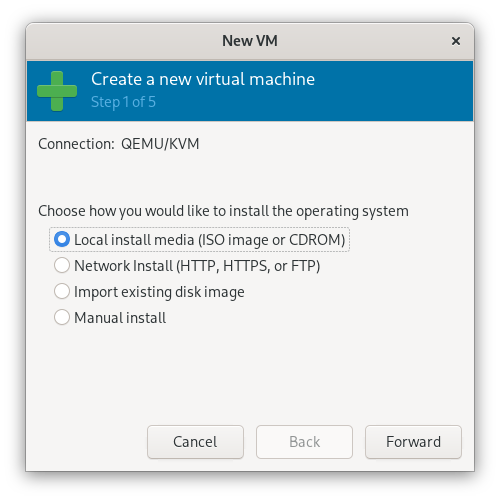

#### 2. Choose the ISO

Select the downloaded Linux distribution ISO as the installation media.

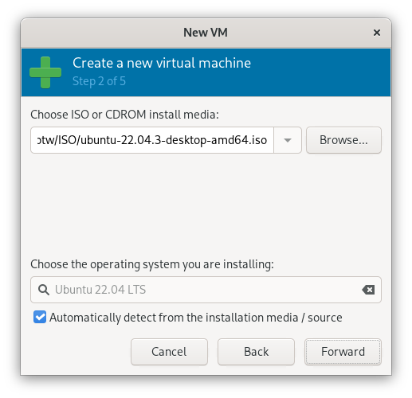

#### 3. Configure RAM and CPU

Set the amount of RAM and the number of CPU cores for the VM.

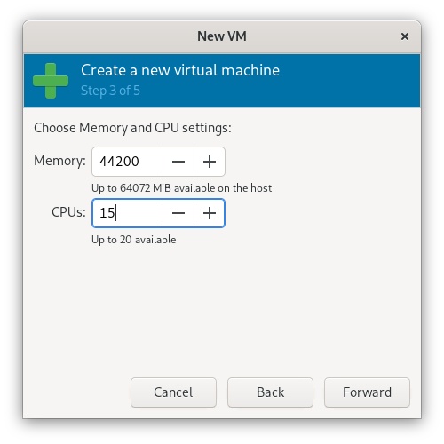

#### 4. Set Up Disks and Enable Storage

Allocate disk space for the VM and enable storage support for the setup.

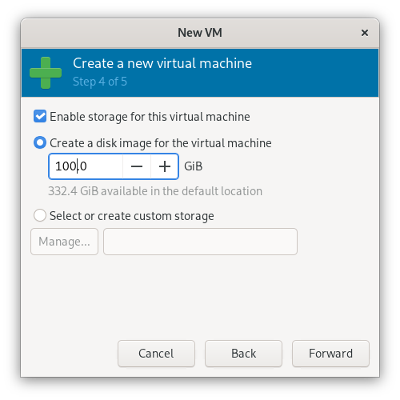

#### 5. Ready to Install

Enable custom configuration settings to fine-tune the installation.

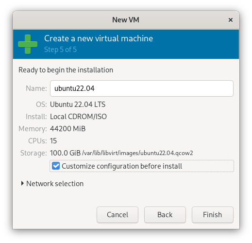

With these settings in place, your VM is now ready for installation. You've efficiently configured the initial parameters for your passthrough setup. Let's proceed to the next steps.

### Step 3: Getting Ready to Install

With your virtual machine (VM) settings configured, it's time to prepare for the Linux installation process. Follow these steps to ensure a smooth installation.

#### 1. Choose UEFI Firmware

Begin by selecting the UEFI firmware for your VM. Choose "UEFI x86_64 OVM_CODE.fd" as the firmware option. This choice is essential for UEFI compatibility and optimal functionality.

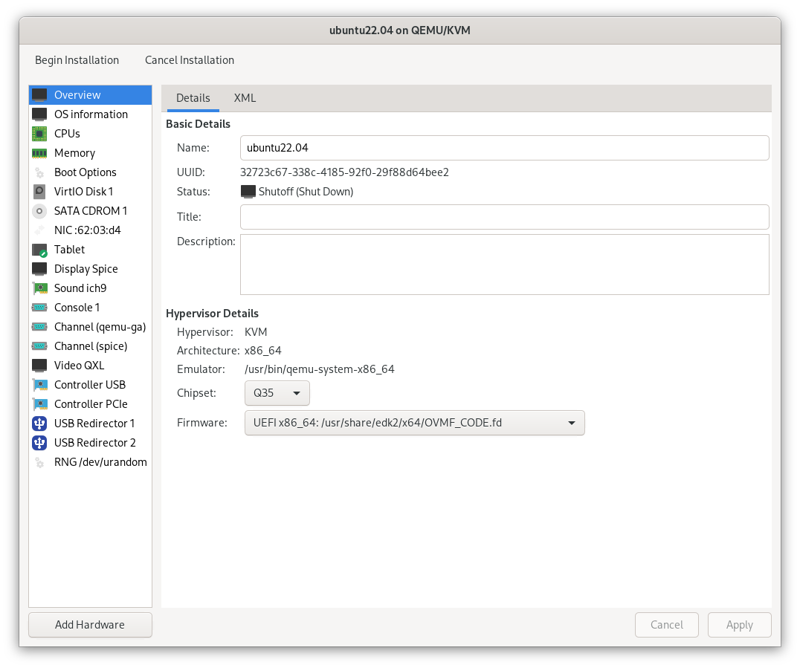

#### 2. Configure Boot Options

Navigate to the boot options section and enable the boot menu. This will allow you to easily select boot devices during startup. Set "SATA CDROM1" as the first boot device to ensure that the VM boots from the installation ISO automatically.

With these crucial preparations in place, your VM is set up for a seamless Linux installation. Proceed with the installation process to bring your passthrough setup to life and enable complete hardware passthrough. Now click `begin installaiton button`.

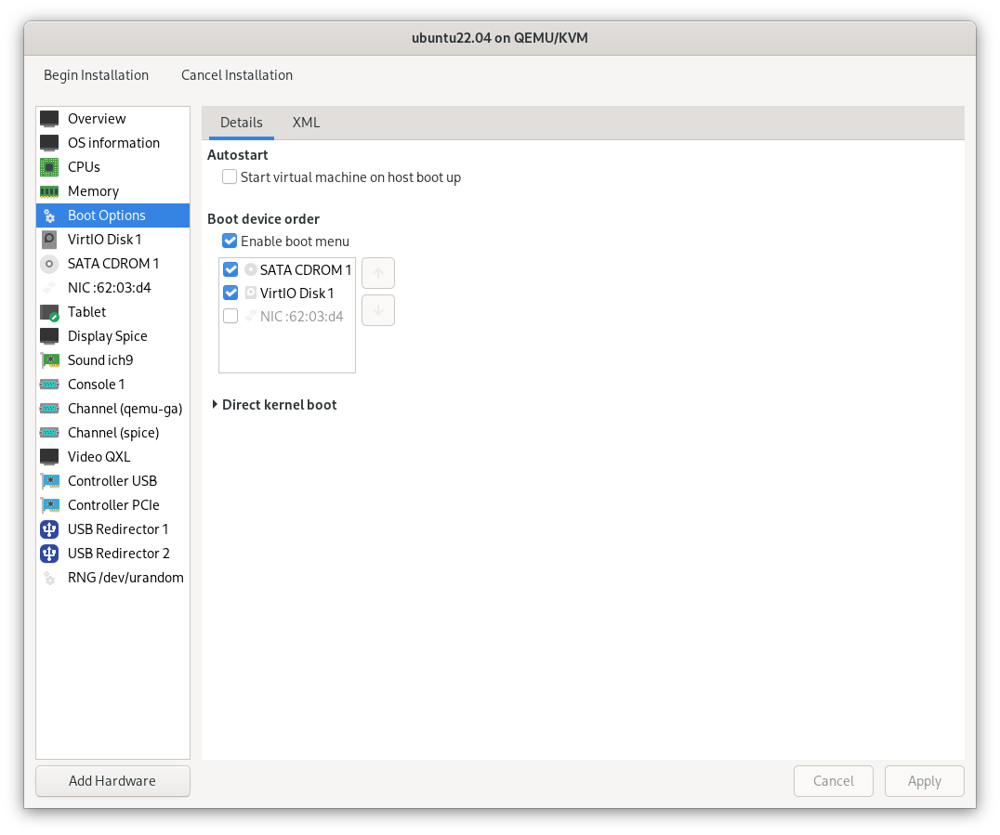

### Step 4: TianoCore UEFI Firmware

Upon starting the VM, you should see the TianoCore UEFI logo and related text displayed. This confirms that your UEFI settings are correctly configured. If you do not see the TianoCore logo and text, it may indicate that you missed a step or that the ISO you are using is not UEFI-compatible and is using BIOS instead.

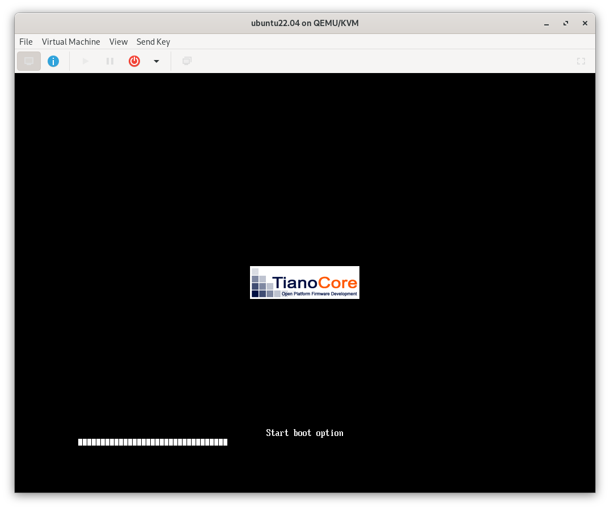

### Step 5: Install Your Linux System

At this stage, you'll need to install your chosen Linux distribution on the virtual machine (VM) you've set up. The installation process for Linux is not specific to passthrough and can be done in the usual manner.

Simply follow these general steps:

1. **Boot from ISO:** Start the VM (`begin installaiton button`), and it will boot from the ISO.

2. **Follow Installation Prompts:** Proceed with the installation by following the prompts from your chosen Linux distribution. This typically involves selecting the installation language, keyboard layout, and configuring disk partitions.

3. **Install Updates and Software:** After installation, it's recommended to update your system and install any additional software you need.

Keep in mind that the installation steps may vary slightly depending on the specific Linux distribution you're using, but the general process remains consistent.

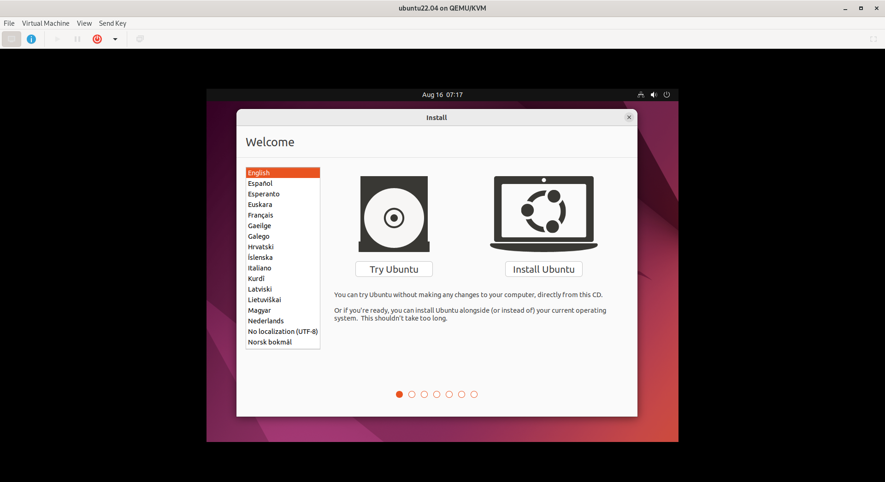

With your Linux system installed, you're now ready to proceed to the final steps of enabling complete hardware passthrough. These upcoming steps will help you unlock the full potential of your passthrough setup and achieve a seamless virtualization experience.

### Step 6: Enabling Network Access, System Upgrade, and GPU Passthrough

If you're planning to perform system upgrades within your virtual machine (VM), ensure seamless network connectivity, and enable GPU passthrough, this step is crucial. Enabling network access is particularly important for tasks such as upgrading your Linux system. Here's how you can achieve this and subsequently upgrade your system (using Ubuntu as an example):

1. **Power Off the VM:** Ensure that your VM is powered off.

2. **Adding PCI Devices for GPU Passthrough:** Access your VM settings in Virt-Manager. Navigate to the "Add Hardware" section and select "PCI Host Device." Choose the desired GPU device and its corresponding GPU audio device from the list. This step allows the VM to have direct access to both the GPU and GPU audio components.

3. **Adding a PCI Network Device:** In the same "Add Hardware" section, select the desired network device from the list. This step allows the VM to have direct access to the network through the designated PCI network device.

4. **Applying Changes and Starting the VM:** Save your settings and start the VM. With the PCI devices passed through, your VM should now have network connectivity and direct access to the GPU and GPU audio components.

5. **Upgrade Your System and Enable GPU Passthrough:**

   Open a terminal within your VM and run the following commands to update and upgrade your system (using Ubuntu as an example):

   ```shell
   sudo apt-get update -y
   sudo apt-get upgrade -y
   sudo apt-get full-upgrade -y
   ```

   After completing the system upgrade, open your system and reboot. Your GPU should now be automatically passed through.

6. **Check GPU Passthrough:**

   Upon rebooting your VM, observe whether the GPU passthrough has taken effect. You should notice that both the GPU and GPU audio components are now successfully passed through to the virtual machine. To verify the status of your GPU, you can install `neofetch` by running:

   ```shell
   sudo apt-get install neofetch
   ```

   After installation, run `neofetch` in the terminal to display detailed information about your GPU and system configuration.

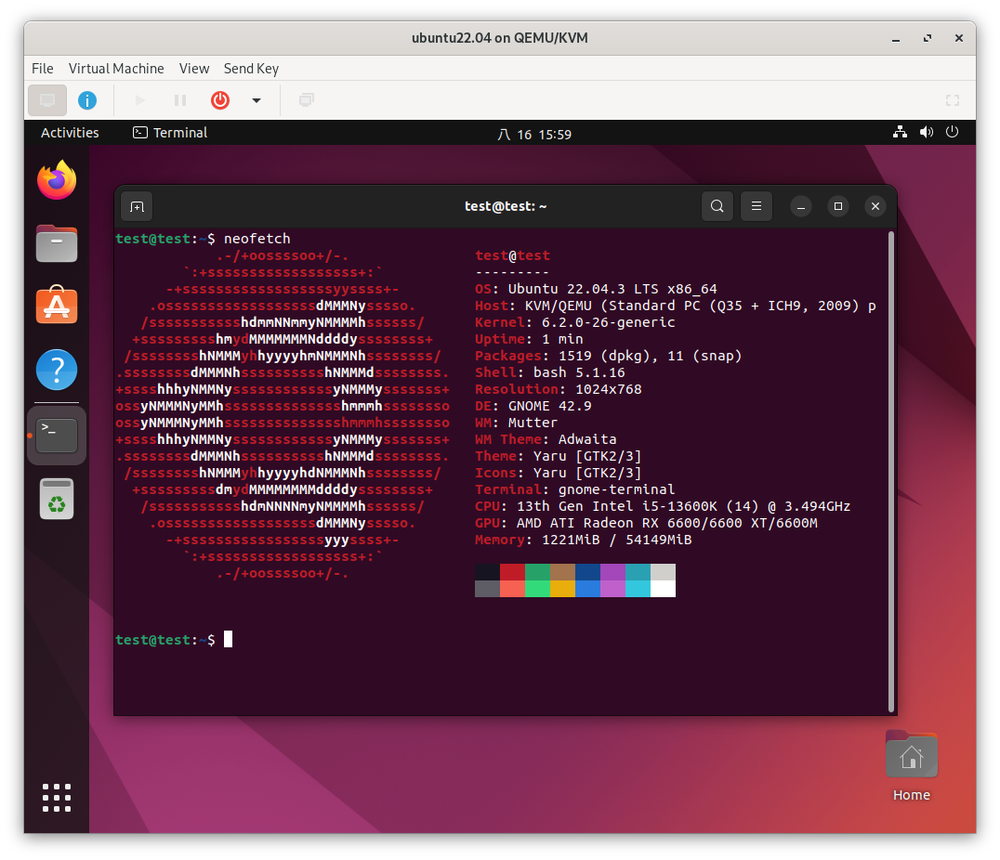

### Final Step: Optimizing Monitor Configuration

As you approach the final stage of your Linux passthrough setup, optimizing your monitor configuration becomes essential to ensure a seamless visual experience. This step involves switching your monitor to a secondary input, such as HDMI2, and configuring your virtual machine (VM) accordingly.

Here's how to complete this process:

1. **Power Off Your VM:** Begin by shutting down your virtual machine.

2. **Configure VM Video Settings:** Access the settings of your VM in Virt-Manager. Navigate to the "Video" section and choose the "Ramfb" device model. Then save your changes.

3. **Switch to Secondary Monitor Input:** On your physical monitor, switch the input source to your desired secondary option, such as HDMI2. This prepares your monitor to receive the output from your VM.

4. **Switch to HDMI2 or Secondary Monitor:** After the VM restarts, switch your physical monitor's input source back to HDMI2 or your chosen secondary input. You should now see the output from your virtual machine on the secondary monitor.

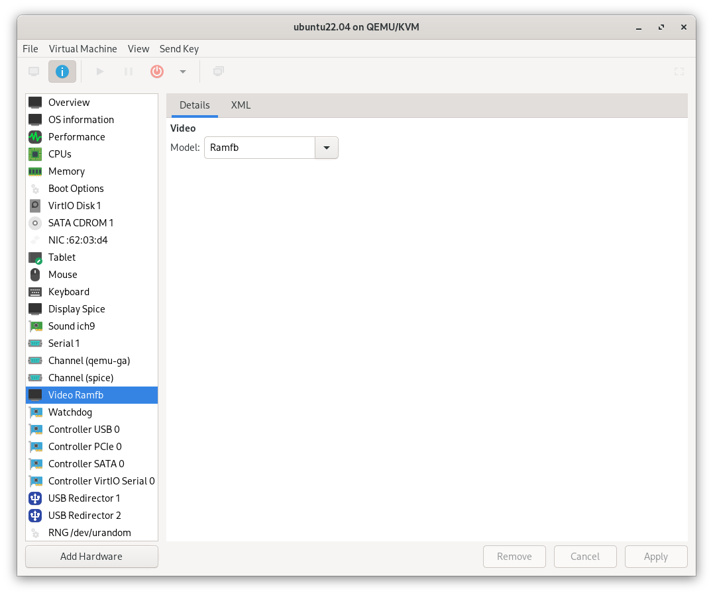

By following these steps, you have successfully configured your monitor to display the output from your Linux VM on a secondary input. This optimization enhances your passthrough experience and provides a dedicated visual channel for your virtual machine. Enjoy the benefits of your fully set up and optimized dual GPU passthrough system!

## **What's Next in Your VM Adventure?**

Congratulations on successfully setting up and optimizing your dual GPU passthrough system! You've unlocked the potential of a high-performance virtual machine (VM) that harnesses dedicated hardware for an exceptional computing experience. However, this is just the beginning of your journey. There's a world of possibilities awaiting you to explore and elevate your VM experience even further. Let's dive into some exciting avenues to consider:

### **1. Harnessing CPU Power**

Your VM's performance can be further enhanced by utilizing physical CPU cores instead of virtual ones. By allocating specific CPU cores to your VM, you can achieve better speed and responsiveness. Dive into your VM's settings and allocate real CPU cores for improved performance.

### **2. Amplify Memory Allocation**

If your VM's tasks demand more memory, increase its allocated RAM. This ensures smoother multitasking and seamless operation of resource-intensive applications. A well-fed VM translates to a more efficient and enjoyable computing experience.

### **3. Seamless Input Integration**

Elevate your VM interaction by passing through your physical mouse and keyboard. This bridges the gap between your host and guest systems, making your virtual environment feel like a natural extension of your workspace.

### **4. Fine-Tune Display Parameters**

Optimize your VM's display settings for the best visual experience. Tweak resolution, refresh rate, and color depth to match your monitor's capabilities. Tailoring the visuals enhances your immersion and productivity.

### **5. Curate Your Software Arsenal**

Customize your virtual environment by installing software that aligns with your goals. Whether you need productivity tools, creative software, or development environments, your VM can cater to your specific requirements.

### **6. Forge Network Connections**

Enable seamless file sharing and resource access between your host and guest systems. This is especially useful for collaborative projects, development, and testing scenarios.

### **7. Embrace Backups and Snapshots**

Implement robust backup strategies and take snapshots of your VM's states. These safety nets provide a way to recover from unexpected issues or experimental endeavors that didn't go as planned.

Remember, your journey to maximize and tailor your virtual machine is ongoing. Embrace experimentation and exploration as you discover the configurations and applications that suit your needs. Whether you're gaming, developing, testing, or all of the above, your VM offers an expansive canvas for you to create your ideal computing environment. Enjoy the boundless potential of your virtual domain!

## Update: August 22, 2023

As part of fully upgrading your system, you might want to consider following these steps. I have personally tested this approach. Simply pass through your mouse, keyboard, PCI device, GPU, and GPU-Audio device. Additionally, switch the video mode to `Ramfb` – it functions well. This configuration enables you to operate in passthrough mode using your live-boot environment.

However, for the optimal experience, I highly recommend conducting a complete system upgrade. If this process doesn't yield the desired results, I suggest attempting an upgrade as well.