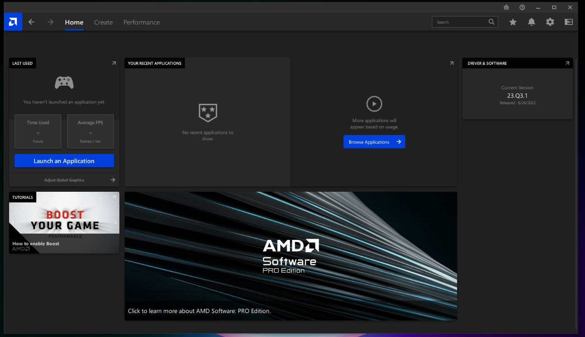
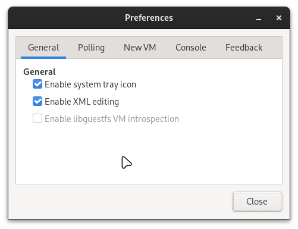
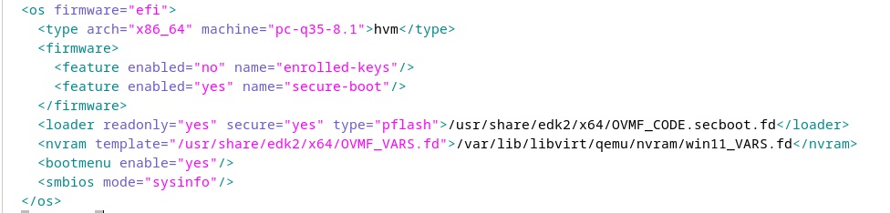
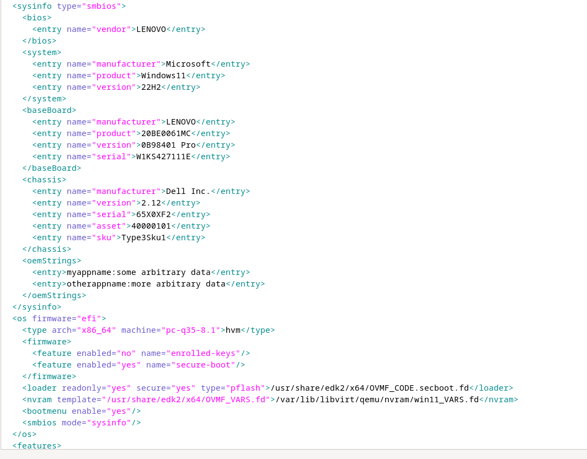

## Introduction

Ensuring your virtual machine operates seamlessly as a fully functional entity, rather than just a simulated environment, is paramount. Missing drivers can compromise certain functions, leading to constant system warnings. To avoid such errors, it's crucial to optimize the system for Windows operation and ensure compatibility. Upon extensive research, it became evident that specific information about your motherboard is required for these drivers to function properly. In a typical virtual machine setup, this crucial information is often missing, creating a gap in functionality that needs to be addressed.

Moreover, it's essential to note that even if your GPU is successfully passed through, your VM can only access the GPU and CPU on your system since there is no motherboard present. To resolve this driver-related issue, the solution involves adding fake motherboard information to the system. After applying the motherboard configuration outlined below and reinstalling the drivers, the system should no longer display any error messages.

>Error message: ... is either not designed to run Windows or contains an error ...


### Why Not Ignore the Error?

While you can still install the drivers without addressing the error, doing so may lead to a lack of certain features. Typically, driver programs include features for gaming layouts and video recording. Ignoring the error might result in these features being unavailable.



## Prerequisites

Before proceeding, make sure you have:

- Virt-manager installed on your system.
- A virtual machine created or ready for creation.
- XML editing enabled (`virt-manger` -> `Edit` -> `Enable XML editing`)



### Steps to Add Fake Motherboard Information

1. **Power Down Your System:**

   Before editing the XML configuration, ensure that your system is powered off.

2. **Open Virtual Machine XML Configuration:**
   
   Open the XML configuration of your virtual machine. You can do this by opening Virt-manager, right-clicking on your virtual machine, selecting "Open," and then navigating to the "Show virtual hardware details" option. Alternatively, you can directly edit the XML by opening the virtual machine's configuration file.

3. **Add Sysinfo Section:**

   At the top of the `<os>` section, add the following code to enable the System Information (Sysinfo) section:

   ```xml
   <os>
       <smbios mode="sysinfo"/>
   </os>
   ```

   After adding the code, it will look like this:

   

4. **Insert Fake Motherboard Information:**

   At the top of the `<os>` section, insert the Sysinfo section with fake motherboard details. This includes information about the BIOS, system, baseboard (motherboard), chassis, and additional OEM strings.

   >Note: This part is not included by default; you can just copy it on top of the `<os>` section completely!

   ```xml
   <sysinfo type="smbios">
       <bios>
           <entry name="vendor">LENOVO</entry>
       </bios>
       <system>
           <entry name="manufacturer">Microsoft</entry>
           <entry name="product">Windows11</entry>
           <entry name="version">22H2</entry>
       </system>
       <baseBoard>
           <entry name="manufacturer">LENOVO</entry>
           <entry name="product">20BE0061MC</entry>
           <entry name="version">0B98401 Pro</entry>
           <entry name="serial">W1KS427111E</entry>
       </baseBoard>
       <chassis>
           <entry name="manufacturer">Dell Inc.</entry>
           <entry name="version">2.12</entry>
           <entry name="serial">65X0XF2</entry>
           <entry name="asset">40000101</entry>
           <entry name="sku">Type3Sku1</entry>
       </chassis>
       <oemStrings>
           <entry>myappname:some arbitrary data</entry>
           <entry>otherappname:more arbitrary data</entry>
       </oemStrings>
   </sysinfo>
   ```

The result should look like this:



### Successfully Implemented Changes

After making these changes, repair your driver software. You should now observe the restoration of features such as video recording and overlay. As shown in the image below:


### Note

When editing the XML configuration with Virt-manager, apply changes and ensure that the code beautifier does not remove any of your added code. If the code is removed after applying changes, it indicates an issue with the section where you included the code. Keep trying until changes are successfully applied.

### Power On

After completing the process, you can boot up the system and repair your drivers. This should not trigger any error messages, whether for CPU or GPU drivers.

## References

- [QEMU/KVM虛擬機繞過遊戲Easy Anti-Cheat的方法，隱藏KVM狀態](https://ivonblog.com/posts/qemu-kvm-bypass-easy-anti-cheat/)
- [Using VRChat in a Virtual Machine](https://docs.vrchat.com/docs/using-vrchat-in-a-virtual-machine)
- [KVM/QEMU: Bypass Anti-Cheat Software VM Detection In 30 Seconds!](https://onion.tube/watch?v=Iass2FMHHng)