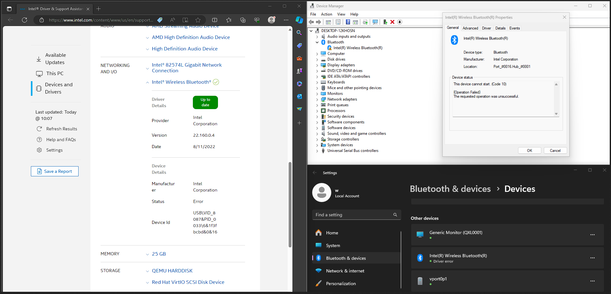
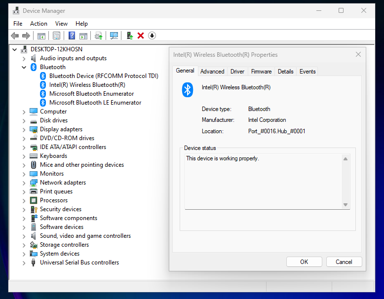

## Introduction

Have you ever encountered an error code 10 when trying to use your Bluetooth gamepad or headphones in a virtual machine? Despite reinstalling the Bluetooth driver, the issue persists. In this blog, we will guide you through the steps to resolve this problem.



### What's the problem?

I quote [Redditor](https://www.reddit.com/r/VFIO/comments/wbsqy1/how_to_fix_onboard_intel_bluetooth_error_code_10/) that said:

The issue stems from a change in libvirt. Libvirt is responsible for parsing all your VM's XML and turning it into a QEMU command. Somewhere between the time libvirt version 6.6 and version 6.9 were released, QEMU slightly changed the way USB devices are handled, and obviously libvirt followed suit. As a result, some USB passthrough configurations, such as the MacOS one in the thread, as well as the onboard bluetooth for windows suffered errors.

## Steps of fix

1. **Power Off Your System:**

   Begin by powering off your system.

2. **Identify Your VM:**

   If you want to finish this process using the shell, identify your virtual machine:

   ```shell
   sudo virsh list --all
   ```

3. **Edit Your Config XML:**

   Edit your XML configuration using your preferred text editor. For Vim:

   ```shell
   sudo EDITOR=vim virsh edit [Your-VM-Name]
   ```

   Add the following section to the `<domain>` section and bottom of the devices part:

   ```xml
   <domain xmlns:qemu="http://libvirt.org/schemas/domain/qemu/1.0" type="kvm">  
     <devices>    
     ...    
     </devices>    
     <qemu:capabilities>    
       <qemu:del capability="usb-host.hostdevice"/>    
     </qemu:capabilities>    
   </domain>
   ```

   Ensure that this XML code is applied simultaneously, rather than in separate instances, to prevent automatic removal of the XML code.

4. **Ensure XML Config Has Been Applied:**

   Restart the virt-manger to check if the config has been applied or inspect the Virt-manager XML editor to see if changes have been applied. Ensure that the code beautifier does not remove any added code. If the code is removed after applying changes, it indicates an issue with the section where you included the code. Keep trying until changes are successfully applied.

5. **Power on Your System:**

  After ensuring that the XML code has been applied, you can now power on your system. Your Bluetooth system should be working without encountering the error code 10. As shown in the image below:



## References

- [How to fix onboard Intel Bluetooth Error Code 10 on Windows guest](https://www.reddit.com/r/VFIO/comments/wbsqy1/how_to_fix_onboard_intel_bluetooth_error_code_10/)
- [Bluetooth device passthrough: Intel Bluetooth Driver Errors Need Help!](https://www.reddit.com/r/VFIO/comments/sdctt2/bluetooth_device_passthrough_intel_bluetooth/)
- [Intel Bluetooth code 10 error Windows 10](https://www.reddit.com/r/VFIO/comments/nej8me/intel_bluetooth_code_10_error_windows_10/)
- [Cannot find 'vi' in path](https://www.reddit.com/r/VFIO/comments/re18ew/cannot_find_vi_in_path/)
- [8 Linux virsh subcommands for managing VMs on the command line](https://www.redhat.com/sysadmin/virsh-subcommands)